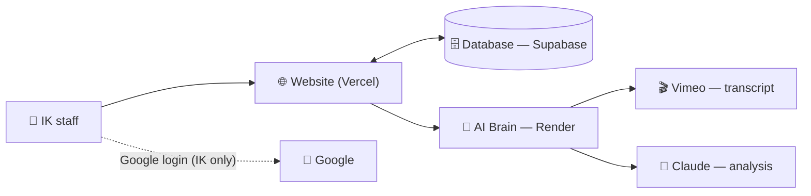

# 🔁 Feedback Loop — IK New Programs

**Turn a low-rated class recording into clear, ready-to-send instructor feedback — written by AI in
minutes, approved by a human before anyone sees it.**

Built for Interview Kickstart's New Programs team, now used across teams.

> 📖 **New here? Read [docs/HOW_IT_WORKS.md](docs/HOW_IT_WORKS.md)** — a deep, plain-English guide to
> everything this system does (written for *anyone*, no tech background needed). Managers, start there.
>
> 🧠 **Want to see exactly what the AI is told?** [docs/THE_AI_ANALYSIS_PROMPTS.md](docs/THE_AI_ANALYSIS_PROMPTS.md)
> shows the **verbatim prompts** behind every analysis, with plain-English notes — so anyone can review
> the "black box" and suggest changes.

🔗 **Live app:** https://feedback-loop-ten.vercel.app · sign in with your **@interviewkickstart.com** Google account.

> ⚙️ **Deploying the worker?** Step-by-step (non-technical) setup incl. `DATABASE_URL`:
> [docs/RENDER_SETUP.md](docs/RENDER_SETUP.md).

---

## What it does (the short version)

When a class is rated low, this app:
1. **Fetches the class transcript** (from Vimeo, or you upload it),
2. **Reads any class materials** you attach — upload a file, paste text, or paste a **link**
   (Google Drive / Docs / Slides, or an internal materials app), fetched automatically,
3. **Runs an AI analysis** against a checklist tailored to the class type (Live class or Assignment
   Review). It first reads the **whole conversation** to work out who's the instructor vs the
   learners and which doubts get resolved later — so it judges the *instructor*, in context, and
   never mistakes a learner's words (or a doubt answered later) for a problem. It produces: an
   overall summary, specific issues (each with a **timestamp + exact quote**), a **short summary to
   send the instructor** (what went well / what didn't / the rating / a suggestion), a **detailed
   internal** feedback draft, and a **PM-only "re-teach this class?"** call,
4. Lets a PM **review, tweak (or tell the AI to rewrite it), and approve** — with a full history.

**The AI only reads and drafts. A human approves everything.**

---

## The picture



- **Website (Next.js on Vercel)** — the screens; owns all reads/writes to the database.
- **Database (Supabase)** — Postgres + login + **Row-Level Security** (only signed-in IK staff can read).
- **AI Brain / worker (Python + FastAPI on Render)** — fetches the Vimeo transcript, reads materials,
  runs the analysis engine (Claude). It's **stateless** — it stores nothing.

Full details, diagrams and a glossary: **[docs/HOW_IT_WORKS.md](docs/HOW_IT_WORKS.md)**.

---

## What's in this repo

| Folder / file | What it is |
|---|---|
| [`web/`](web/) | The website — Next.js (App Router, TypeScript), Tailwind, shadcn-style UI. Deploys to Vercel (root dir = `web/`). |
| [`ratings_module_build_kit/`](ratings_module_build_kit/) | The AI Brain — Python FastAPI worker + the analysis engine (`engine.py`), Vimeo fetch (`vimeo.py`). Ships as a Docker container (Render). |
| [`supabase/`](supabase/) | The database schema — SQL migrations + security policies (`migrations/`), applied by `apply_migrations.py`. |
| [`docs/`](docs/) | Plain-English documentation — start with [`HOW_IT_WORKS.md`](docs/HOW_IT_WORKS.md). |
| [`DEPLOY.md`](DEPLOY.md) | How the website + worker are deployed. |
| [`BUILD_SPEC.md`](BUILD_SPEC.md) | The original build brief. |

---

## Features (today)

- ✅ **Feedback module** — end to end (analyze → review → revise-with-AI → approve/delete), for **Live**
  and **ARS** class types with separate rubrics.
- ✅ **Smart New-Analysis form** — Course → Cohort → Class dropdowns (instructor auto-fills), multiple
  materials upload, Vimeo link or file upload.
- ✅ **Courses** — any staff member adds their team's courses (B2B, DSA…), instantly usable.
- ✅ **Assignments** — assign instructors to a cohort's schedule + download an updated sheet.
- ✅ **Admin** — merge duplicate instructor names.
- ✅ **Dashboard** — counts, by-course breakdown, recent analyses; queue with course filter + "created by".
- ✅ **Security & privacy** — Google login (IK-only), database-level access control, materials never
  stored, transcripts auto-purged after 20 days, no confidential data in this repo.

**Coming next (placeholders visible in the app):** Learner / Instructor / Course / Cohort analytics,
and a Learner Health Score.

---

## 💡 Want to suggest something?

You **don't need to be technical**. Open an **[Issue](../../issues)** describing what you'd like —
a change to the feedback tone, a new class type, a new report, anything. The whole team can shape this.

---

## For developers

Local run:
```bash
# AI Brain (needs ANTHROPIC_API_KEY, optionally VIMEO_ACCESS_TOKEN in ratings_module_build_kit/.env)
cd ratings_module_build_kit && ./.venv/Scripts/python -m uvicorn service:app --port 8000

# Website (needs Supabase keys in web/.env.local)
cd web && npm install && npm run dev
```
Tests: `cd ratings_module_build_kit && ./.venv/Scripts/python -m unittest`.
Deploy: see **[DEPLOY.md](DEPLOY.md)**. Secrets live in `.env` / `.env.local` (gitignored) and in
Vercel/Render settings — **never** in the code.
