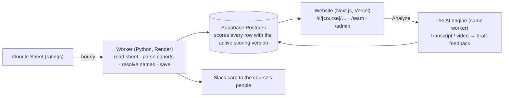

# 🔁 Feedback Loop — IK New Programs

**Every class the New Programs team runs, scored the same way, with the ones that need attention
turned into ready-to-send instructor feedback — drafted by AI, approved by a person.**

Built for Interview Kickstart's New Programs team. Version 3 (September 2026) turns the
single-PM tool into one platform for the whole team: live ratings data, one score for every class,
a workspace per course, and a leadership view across all of them.

> 🚀 **Using the tool? Start with [docs/USER_GUIDE.md](docs/USER_GUIDE.md)** — task by task, in
> plain English: finding this week's classes, running an analysis, reading a score, printing the
> weekly report, changing a scoring setting.
>
> 🧭 **Executives and new stakeholders:** [docs/EXECUTIVE_SUMMARY.md](docs/EXECUTIVE_SUMMARY.md)
> (two pages).
>
> 📖 **Want to understand how it all fits together?** [docs/HOW_IT_WORKS.md](docs/HOW_IT_WORKS.md)
> — the data pipeline, the Class Sentiment Score, the queue, ownership, identity, the AI engine.
>
> 🧠 **Want to see exactly what the AI is told?** [docs/THE_AI_ANALYSIS_PROMPTS.md](docs/THE_AI_ANALYSIS_PROMPTS.md)
> shows the verbatim prompts behind every analysis.

🔗 **Live app:** https://feedback-loop-ten.vercel.app · sign in with your **@interviewkickstart.com**
Google account.

---

## What it does

1. **Pulls every rated class from the team's ratings sheet, once an hour.** No typing classes in.
   The sheet stays the source; the app keeps a scored copy.
2. **Gives each class one number: the Class Sentiment Score (0–100).** It combines the star rating,
   instructor approval (would learners have this instructor back), how many learners rated the
   class, and how many of those who attended that represents. Four bands: **Excellent** (90 and
   up), **Good** (75–89), **Average** (60–74), **Bad** (under 60).
3. **Lets the band decide how deep we look.** Bad gets the full check: the transcript *and* sampled
   frames from the recording. Average gets the transcript only. Good and Excellent get nothing
   unless a PM asks. Too few learners answered, no band, so it goes on the watch list. That is the
   *Needs analysis* queue, per course and across the team.
4. **Tells the right people on Slack.** A flagged class posts a card that names the course's
   people, says why in plain words, and links straight into the queue.
5. **Runs the AI analysis** on the recording (transcript, or transcript plus video frames), checks
   its own findings with a second sceptical pass, and drafts a short note for the instructor plus a
   detailed internal version. A PM reviews, edits, approves and marks it sent. **Nothing is ever
   sent automatically.**
6. **Shows the picture** — a workspace per course (overview, classes, instructors, cohorts,
   modules, reports) and a team level for leadership (all courses, movers, capacity, the loop).
7. **Keeps the scoring rules as data, not code.** Every setting is a stored, numbered version.
   An admin previews a change on a month of real classes, activates it (every class is re-scored
   in one step), and can roll back. Any PM can try a what-if and propose it.

**Which version is live, and how that was decided.** Version 1, the manager's original
(60 / 30 / 6 / 4, pass-fail approval), is active. We built an alternative meant to be fairer to
classes judged by only a handful of learners, found the classes where the two disagree most, and
settled it on our own recordings rather than by argument: twelve classes, both directions, scored
against rules written down before any result existed ([docs/FORMULA_TEST_RULES.md](docs/FORMULA_TEST_RULES.md)).
The original was right on seven of the twelve, so it stays. The report that explains this to a
manager or a VP is built by `analysis/build_decision_report.py`.

---

## The picture


```mermaid
flowchart LR
  GS["Google Sheet (ratings)"] -->|hourly| SY["Worker (Python, Render)<br/>read sheet · parse cohorts · resolve names · save"]
  SY --> DB[("Supabase Postgres<br/>scores every row with the active scoring version")]
  DB --> WEB["Website (Next.js, Vercel)<br/>/c/[course]/… · /team · /admin"]
  SY --> SL["Slack card to the course's people"]
  WEB -->|Analyze| AI["The AI engine (same worker)<br/>transcript / video → draft feedback"]
  AI --> DB
```

- **Website** — the screens. Reads and writes the database under row-level security.
- **Database (Supabase)** — Postgres plus sign-in. Holds the classes, scores, scoring versions,
  instructors and aliases, cohorts, modules, course members, analyses, and the audit log. The
  scoring function lives here, so a rule change re-scores every class in one statement.
- **Worker (Python on Render)** — two jobs in one service: the hourly ratings sync (and *Sync now*),
  and the AI analysis engine (Vimeo transcript, optional video frames, Claude, the self-check).

---

## Where things are in the app

| Where | What |
|---|---|
| `/c/<course>/overview` | The course in one screen: KPIs vs the previous period, the weekly score line, band mix, worst classes, instructors, cohorts, modules, score against how many learners rated, a calendar. |
| `/c/<course>/classes` | Every class, scored, with colour chips above the table that say what each band means and filter by one or several at once. Click a row for the drawer: the score's arithmetic, instructor approval, the instructor's recent classes, what the rule says and why, the actions. |
| `/c/<course>/queue` | **Needs analysis**: Bad → video, Average → transcript, Watch. The reason under each row, the week's cost at the top, Confirm · Dismiss · Escalate · Analyze. |
| `/c/<course>/instructors`, `/cohorts`, `/modules` | Leaderboard and portfolios; the curriculum map (every cohort × every module: rating, rated/attended, attendance drops, who lifts a module) with journeys; module diagnostics and the module × instructor matrix. Every table sorts. |
| `/c/<course>/feedback` | This course's AI analyses. The engine itself is unchanged at `/feedback/new` and `/feedback/<id>`. |
| `/c/<course>/reports` | Weekly / monthly / custom report: print to PDF, CSV, a read-only share link. |
| `/c/<course>/settings` | Team (owner · PM · viewer, the handler, hand-over), cohorts, modules, Slack notifications, share links. |
| `/team` | Leadership level: course cards, small multiples, movers, course × month, queue capacity, loop health, housekeeping. Plus `/team/queue`, `/team/instructors`, `/team/reports`, `/team/insights`. |
| `/admin/scoring` · `/identity` · `/people` · `/sync` · `/audit` | Scoring versions with live preview; duplicate instructor names; who owns which course; sync runs; the audit log. |
| `/tools/what-if` | The scoring editor as a read-only simulator for any PM, with *Propose to admin*. |

Old links (`/dashboard`, `/ratings`, `/course-analytics`, `/instructor-analytics`, `/reports`,
`/insights`, `/feedback`, `/courses`, `/instructors`) redirect to the new places, so Slack messages
already sent keep working. `⌘K` (Ctrl-K) jumps anywhere.

---

## What's in this repo

| Folder / file | What it is |
|---|---|
| [`web/`](web/) | The website — Next.js (App Router, TypeScript), Tailwind. Deploys to Vercel (root dir `web/`). `npm test` runs the score mirror against the shared fixtures. |
| [`ratings_module_build_kit/`](ratings_module_build_kit/) | The worker — FastAPI. `ratings_sync.py`, `sheet_source.py`, `cohort_parse.py`, `instructor_match.py`, `notify.py` (the sync); `engine.py`, `video.py`, `vimeo.py` (the AI engine). Ships as a Docker container (Render). Its own [README](ratings_module_build_kit/README.md) lists every file and endpoint. |
| [`supabase/`](supabase/) | The database: `migrations/` (0001 → 0023, applied in order by `apply_migrations.py`), `fixtures/` (the scoring contract: six configurations, 94 cases), `test_scoring_sql.py`. |
| [`analysis/`](analysis/) | The scoring reference (`sentiment_score.py`), the validation study (`sentiment_*.py`, `sentiment_run_all.py`), and local tools (`db_backup.py`, `resync_from_workbook.py`). Outputs go to `analysis/out/` (not committed). |
| [`docs/`](docs/) | User guide, how it works, executive summary, run-local, Render setup, [Google Sheet setup](docs/GOOGLE_SHEET_SYNC_SETUP.md), [Vimeo video access](docs/VIMEO_VIDEO_ACCESS.md), [learner-data contract](docs/LEARNER_INGEST_CONTRACT.md), the AI prompts, [what the analysis got wrong and how it was fixed](docs/ENGINE_AUDIT.md), [how the two formulas were judged](docs/FORMULA_TEST_RULES.md). |
| [`DEPLOY.md`](DEPLOY.md) | How the three pieces are deployed, the v3 release steps, and how to roll back. |

Confidential things never live here: the ratings workbook, the study PDFs and Word documents,
key files and `.env` files are all gitignored.

---

## Features in v3 (today)

- **Live data** — the ratings sheet synced hourly; columns read by name; the class name taken from
  the `Class` column (the Agentic tab's `Topic` column is the session kind — fixed 3 Sep 2026).
- **The Class Sentiment Score** on every class, with the arithmetic one hover away, four fixed band
  colours, and averages drawn differently from class scores so they are never confused.
- **The queue by band**, with the reason in plain words and the week's cost in dollars and hours.
- **Course workspaces** and the **team level**, a course switcher, and the command palette.
- **Instructor identity** — spellings resolved through aliases at sync time; suspected duplicates
  suggested after every sync; a human accepts or rejects; merges undoable for 30 days.
- **Cohorts and modules** parsed from the sheet's own text: journeys week by week, module
  hot-spots, "content problem vs delivery problem" tags, the best-known SME per module.
- **People and ownership** — course members (owner · PM · viewer), exactly one handler per course,
  hand-over with a note, Slack routing to the course's people.
- **Configurable scoring** — seven stored versions; draft → preview on a month → activate → roll
  back; what-if for PMs. Version 1 is live.
- **Reports** per course and across the team: weekly / monthly / custom, print, CSV, share link.
- **The AI feedback engine** — transcript and optional video analysis, the self-check pass, two
  outputs (the note to send and the internal detail), a PM-only re-teach call. Substantially
  repaired in September 2026 after seven independent reviews: the whole-class summary used to cover
  only the first part of a long class, a single out-of-order caption line could discard a class
  silently, and a failed self-check looked identical to a clean one. Every defect and the evidence
  for it is in [docs/ENGINE_AUDIT.md](docs/ENGINE_AUDIT.md).
- **Audit log** of every meaningful action, and a health check that names the live build and the
  active scoring version.

**Planned (designed, not built):** the weekly Slack digest, a server-rendered PDF, the learner-level
pages (the tables and the [contract](docs/LEARNER_INGEST_CONTRACT.md) exist; the data does not yet),
per-course scoring overrides, a TA-quality view, and the bump chart. See
[HOW_IT_WORKS.md](docs/HOW_IT_WORKS.md#16-what-is-planned-not-built).

---

## 💡 Want to suggest something?

You do not need to be technical. Open an **[Issue](../../issues)** or message Bishal Roy
(New Programs) — a change to the feedback tone, a scoring setting you would like to try, a new
report, anything.

---

## For developers

Run it locally (details in [docs/RUN_LOCAL.md](docs/RUN_LOCAL.md)):
The worker refuses to serve without `WORKER_API_KEY` set — it used to accept anything when the
key was missing, which was the shipped default. On a local machine that nothing outside can reach,
`WORKER_ALLOW_NO_AUTH=1` is the explicit opt-out.

```bash
# Worker (needs ratings_module_build_kit/.env — see .env.example for the variable names)
cd ratings_module_build_kit && ./.venv/Scripts/python -m uvicorn service:app --port 8000

# Website (needs web/.env.local)
cd web && npm install && npm run dev
```

Tests:
```bash
cd ratings_module_build_kit && ./.venv/Scripts/python -m unittest      # 339 tests, offline
cd web && npm test                                                     # 138 tests: the score mirror vs the fixtures, and the report window
./ratings_module_build_kit/.venv/Scripts/python supabase/test_scoring_sql.py   # the SQL function vs the same fixtures (needs DATABASE_URL)
cd web && npx tsc --noEmit                                             # type-check
```

Local tools (run with the worker's Python, `./ratings_module_build_kit/.venv/Scripts/python`):
`analysis/db_backup.py` (full JSON backup), `analysis/resync_from_workbook.py --check|--run`
(push the local workbook copy through the worker's sync path), and `node web/scripts/shots.mjs`
(screenshots of every page, light and dark).

**Deployed.** The website runs on Vercel at https://feedback-loop-ten.vercel.app and the worker on
Render. The worker's `/health` names the live commit and the active scoring version, which is the
quickest way to tell whether a deploy landed. Render's free plan lets the worker sleep when idle, so
the first request after a quiet spell can take up to a minute; that is not a fault.

See **[DEPLOY.md](DEPLOY.md)** for the release steps and how to roll back. Secrets live in `.env` /
`.env.local` (gitignored) and in Vercel / Render / Supabase Vault settings, never in the code.
