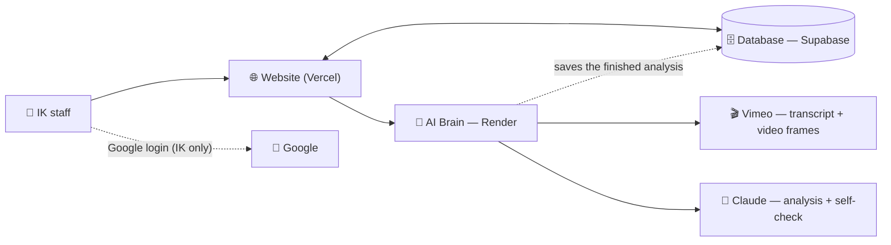

# 🔁 Feedback Loop — IK New Programs

**Turn a low-rated class recording into clear, ready-to-send instructor feedback — written by AI in
minutes, approved by a human before anyone sees it.**

Built for Interview Kickstart's New Programs team, now used across teams.

> 🚀 **Using the tool? Start here → [docs/USER_GUIDE.md](docs/USER_GUIDE.md)** — step-by-step, plain
> English, from signing in to sending the feedback. (An illustrated version with real screenshots of
> every screen is shared separately by the New Programs team.)
>
> 🧭 **Executives / new stakeholders:** start with the **[Executive Summary](docs/EXECUTIVE_SUMMARY.md)**
> (2-page overview with links).
>
> 📖 **New here? Read [docs/HOW_IT_WORKS.md](docs/HOW_IT_WORKS.md)** — a deep, plain-English guide to
> everything this system does (written for *anyone*, no tech background needed). Managers, start there.
>
> 🧠 **Want to see exactly what the AI is told?** [docs/THE_AI_ANALYSIS_PROMPTS.md](docs/THE_AI_ANALYSIS_PROMPTS.md)
> shows the **verbatim prompts** behind every analysis, with plain-English notes — so anyone can review
> the "black box" and suggest changes.

🔗 **Live app:** https://feedback-loop-ten.vercel.app · sign in with your **@interviewkickstart.com** Google account.

> ⚙️ **Deploying the worker?** Step-by-step (non-technical) setup incl. `DATABASE_URL`:
> [docs/RENDER_SETUP.md](docs/RENDER_SETUP.md).
>
> 🎬 **Want the AI to watch the class video too** (camera / screen / slides checks)? One-time Vimeo
> setup: [docs/VIMEO_VIDEO_ACCESS.md](docs/VIMEO_VIDEO_ACCESS.md).

---

## What it does (the short version)

When a class is rated low, this app:
1. **Tells you whether the class even needs analysing — and which kind.** A built-in helper applies the
   team rule (rating > 4.5 → usually skip · below 4.5 with ≥ 80% rating participation → video · below
   80% → transcript · any escalation → always video) and can switch video on with one click,
2. **Fetches the class transcript** (from Vimeo, or you upload it),
3. **Optionally watches the class**, sampling a frame every 2–3 minutes to check camera on/off, screen
   sharing, and whether the slides match the plan — problems a transcript can never reveal
   (**+31% more real issues found** in our measured A/B study),
4. **Reads any class materials** you attach — upload a file, paste text, or paste a **link**
   (Google Drive / Docs / Slides, or an internal materials app), fetched automatically,
5. **Runs an AI analysis** against a checklist tailored to the class type (Live class or Assignment
   Review). It first reads the **whole conversation** to work out who's the instructor vs the
   learners and which doubts get resolved later — so it judges the *instructor*, in context, and
   never mistakes a learner's words (or a doubt answered later) for a problem. It produces: an
   overall summary, specific issues (each with a **timestamp + exact quote**), a **short bulleted note to
   send the instructor** (each bullet = one specific error + how to fix it), a **detailed
   internal** feedback draft, and a **PM-only "re-teach this class?"** call,
6. **Argues against its own findings.** A second, deliberately sceptical pass re-checks every serious
   flag against the real transcript and can **drop or downgrade** it — never invent or escalate one.
   The report shows exactly what it changed and why,
7. Lets a PM **review, tweak (or tell the AI to rewrite it), approve, and mark as sent** — with a full
   history.

**The AI only reads and drafts. A human approves everything.**

---

## The picture


```mermaid
flowchart LR
  U["👤 IK staff"] --> W["🌐 Website (Vercel)"]
  U -. Google login (IK only) .-> G["🔑 Google"]
  W <--> DB[("🗄️ Database — Supabase")]
  W --> AI["🧠 AI Brain — Render"]
  AI --> V["🎬 Vimeo — transcript + video frames"]
  AI --> C["🤖 Claude — analysis + self-check"]
  AI -. saves the finished analysis .-> DB
```

- **Website (Next.js on Vercel)** — the screens; owns all reads/writes to the database.
- **Database (Supabase)** — Postgres + login + **Row-Level Security** (only signed-in IK staff can read).
- **AI Brain / worker (Python + FastAPI on Render)** — fetches the Vimeo transcript (and, when asked,
  samples video frames), reads materials, and runs the analysis engine (Claude) including the
  self-check pass. It keeps **no state of its own** and stores no files — transcripts, materials and
  frames are used for that one analysis and discarded; only the finished analysis is written to the
  database.

Full details, diagrams and a glossary: **[docs/HOW_IT_WORKS.md](docs/HOW_IT_WORKS.md)**.

---

## What's in this repo

| Folder / file | What it is |
|---|---|
| [`web/`](web/) | The website — Next.js (App Router, TypeScript), Tailwind, shadcn-style UI. Deploys to Vercel (root dir = `web/`). |
| [`ratings_module_build_kit/`](ratings_module_build_kit/) | The AI Brain — Python FastAPI worker + the analysis engine (`engine.py`), Vimeo fetch (`vimeo.py`). Ships as a Docker container (Render). |
| [`supabase/`](supabase/) | The database schema — SQL migrations + security policies (`migrations/`), applied by `apply_migrations.py`. |
| [`docs/`](docs/) | Plain-English documentation — [`USER_GUIDE.md`](docs/USER_GUIDE.md) to *use* it, [`HOW_IT_WORKS.md`](docs/HOW_IT_WORKS.md) to *understand* it. |
| [`DEPLOY.md`](DEPLOY.md) | How the website + worker are deployed. |
| [`BUILD_SPEC.md`](BUILD_SPEC.md) | The original build brief. |

---

## Features (today)

- ✅ **Feedback module** — end to end (analyze → review → revise-with-AI → approve → **mark as sent**),
  for **Live** and **ARS** class types with separate rubrics.
- ✅ **Which-analysis helper** — the team's selection rule built into the New-Analysis page: enter
  rating / attended / rated (+ escalation) → it recommends skip, transcript or video, and applies it.
- ✅ **Video analysis** *(optional per class)* — frames sampled straight from Vimeo, checked for camera,
  screen share and slide/plan mismatch. Frames are analysed in memory and **never stored**.
- ✅ **AI self-check** — an adversarial verification pass that drops or softens unproven findings, shown
  transparently in the report (and a "✓ Self-checked" badge).
- ✅ **Trust & verification in the UI** — "🎬 Video verified · N frames" / "Transcript only" badges with
  the reason, and a **▶ Watch recording** link straight to the class video.
- ✅ **New-Analysis form** — course (or add one inline), topic, instructor autocomplete, class type,
  materials by upload/link/paste, Vimeo link or transcript upload, optional **video analysis**.
- ✅ **Courses** — any staff member adds their team's courses (B2B, DSA…), instantly usable.
- ✅ **Admin** — merge duplicate instructor names.
- ✅ **Dashboard** — counts, AI spend (monthly + all-time), recent analyses, **live AI-engine status**
  (which also pre-warms the worker); queue with course/month filters.
- ✅ **Resilient by design** — failed analyses are recorded as `failed` with the reason, stalled runs are
  detected, and both offer a one-click **Retry**.
- ✅ **Security & privacy** — Google login (IK-only), database-level access control, materials and video
  frames never stored, transcripts auto-purged after 20 days, no confidential data in this repo.

**Coming next:** pulling the Vimeo link (and low-rated classes) automatically from UpLevel, so the
intake is end-to-end; plus Learner / Instructor / Course analytics and a Learner Health Score
(placeholders already visible in the app).

---

## 💡 Want to suggest something?

You **don't need to be technical**. Open an **[Issue](../../issues)** describing what you'd like —
a change to the feedback tone, a new class type, a new report, anything. The whole team can shape this.

---

## For developers

Local run:
```bash
# AI Brain (needs ANTHROPIC_API_KEY, optionally VIMEO_ACCESS_TOKEN in ratings_module_build_kit/.env)
cd ratings_module_build_kit && ./.venv/Scripts/python -m uvicorn service:app --port 8000

# Website (needs Supabase keys in web/.env.local)
cd web && npm install && npm run dev
```
Tests: `cd ratings_module_build_kit && ./.venv/Scripts/python -m unittest` (181 tests) ·
web typecheck: `cd web && npx tsc --noEmit`.
Deploy: see **[DEPLOY.md](DEPLOY.md)**. Secrets live in `.env` / `.env.local` (gitignored) and in
Vercel/Render settings — **never** in the code.
