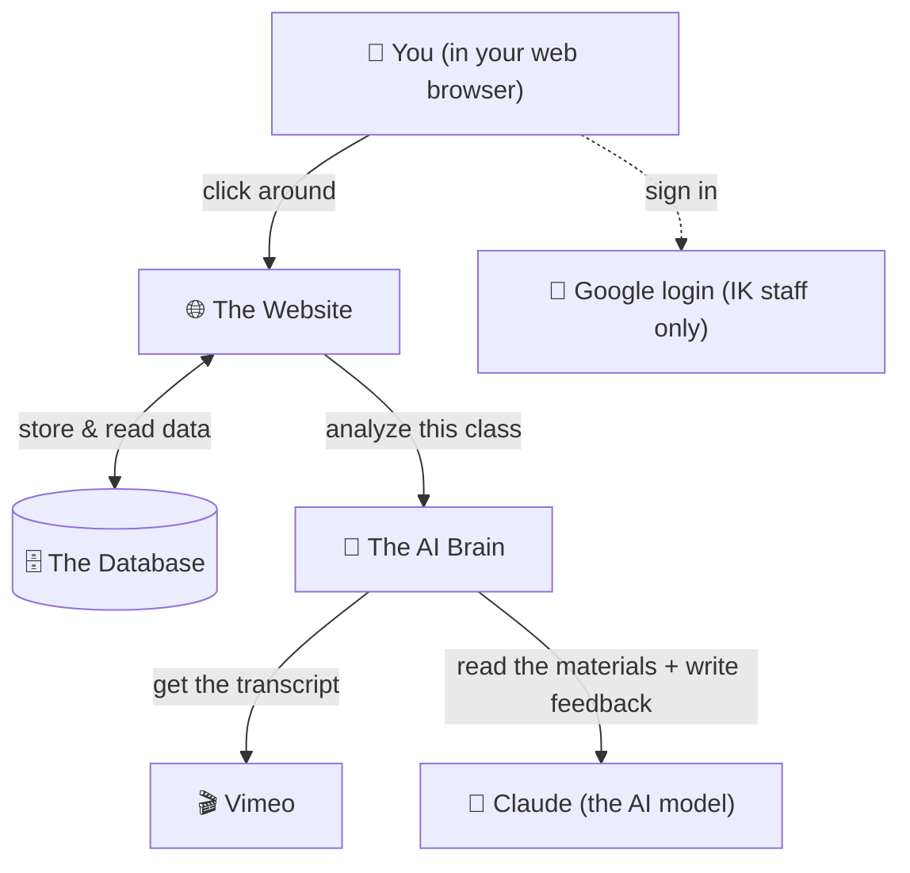
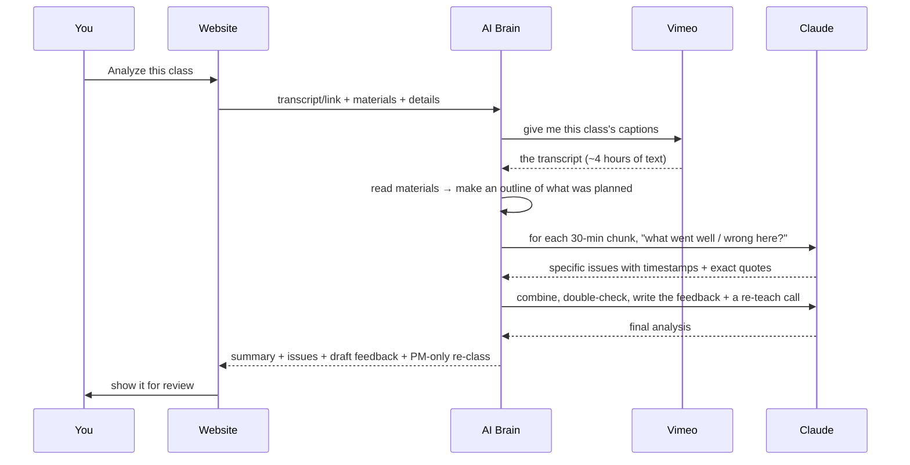

# How the Feedback Loop works — the full story, in plain English

> This guide explains **everything** the system does, top to bottom, with **no assumed technical
> knowledge**. If you're a manager, a PM, or just curious — this is written for you. Every "black
> box" is opened up and explained simply. Read top to bottom, or jump to a section.

---

## 1. What this is, in one line

**A website that turns a low-rated class recording into clear, ready-to-send feedback for the
instructor — written by AI in minutes, and approved by a human before anyone sees it.**

## 2. The problem it solves

When a class gets a low learner rating, someone has to:
1. Watch the **entire ~4-hour recording**,
2. Figure out what went wrong (pacing? unclear? skipped topics?),
3. Write kind, specific feedback for the instructor.

That's **2–4 hours of work per class**. With ~1–4 low-rated classes a week, it adds up fast.

**The Feedback Loop does the watching and the first draft in a few minutes for a few cents.** A
person then just **reviews, tweaks, and approves**. The AI never sends anything on its own — a
human always has the final say.

---

## 3. The big picture — who does what

Think of it as **five helpers** working together:

| Helper | Plain-English job | Where it lives |
|---|---|---|
| 🌐 **The Website** | The screens you click — dashboard, forms, buttons. | Vercel (a website host) |
| 🔑 **Google login** | Lets **only @interviewkickstart.com** people in. | Google |
| 🗄️ **The Database** | The secure filing cabinet — stores everything. | Supabase |
| 🧠 **The AI Brain** | The "specialist" that watches the class and writes feedback. | Render (a small server) |
| 🎬 **Vimeo** | Where the class recordings + their captions live. | Vimeo |
| 🤖 **Claude** | The actual AI model that reads and writes. | Anthropic |

---

## 4. The journey of ONE class (step by step)

Here's exactly what happens, start to finish. The parts in **_italics_** are the behind-the-scenes
magic that's normally hidden.

**Step 1 — You log in.** You go to the website and click **"Continue with Google"**. Only IK staff
get in; anyone else is bounced out automatically.

**Step 2 — You start a New Analysis.** You pick the **Course → Cohort → Class** from dropdowns (the
instructor, topic and date fill in automatically from the schedule). You add the **rating**, choose
the **class type** (Live class or Assignment Review), and give it the recording — either **paste the
Vimeo link** or **upload the transcript file**. Optionally, you attach the **class materials**
(slides, coding notebook, docs) — as many as you like.

**Step 3 — You click "Analyze."** Now the hidden work begins:

_**a.** The website hands the job to the **AI Brain**._
_**b.** The Brain goes to **Vimeo** and downloads the class **captions** (the transcript — everything the instructor said)._
_**c.** It reads your **materials** and boils them into a short outline of *what was supposed to be taught*._
_**d.** It splits the long transcript into **30-minute chunks**, and for each chunk asks **Claude**: "what went well or wrong here?" — collecting **specific moments, each with a timestamp and the exact words**._
_**e.** It **combines** all the findings, **double-checks** each one (drops anything the quote doesn't support), and writes four things:_
   - _an **overall summary** of what likely caused the low rating,_
   - _a **list of issues** (each with severity + a timestamped quote),_
   - _a **polished feedback message** for the instructor (formal, kind, to the point, 150–250 words),_
   - _a **private "should this class be re-taught?" call** — for the PM only, never shown to the instructor._

**Step 4 — You review.** You see everything on one screen. If the draft wording isn't right, you
have two options:
- **Edit it directly**, or
- Use the **"Tell the AI what to change"** box — type something like *"make it shorter"* or *"focus
  on the skipped problems"* and the AI **rewrites the draft right there**. Keep going until it's right.

**Step 5 — You decide.** Click **Approve** (it's stored, with your edits kept separately from the
original so we can see how much you changed), **Discard**, or **Delete** it entirely. Nothing is ever
sent to the instructor automatically — you're always in control.

---

## 5. The "black boxes" — each helper, opened up

### 🌐 The Website (hosted on **Vercel**)
This is everything you see and click. It's a modern web app. It **does not do the heavy thinking
itself** — it collects your input, shows results, and talks to the other helpers. It updates
automatically whenever we improve the code.

### 🔑 The Login (Google, IK-only)
Instead of yet another password, you sign in with your **IK Google account** — the same one you use
for email. The system is locked so that **only `@interviewkickstart.com` accounts can enter**. If
someone outside IK tries, they're signed out instantly. Anyone from IK who logs in automatically
becomes a **staff member** who can use the tool.

### 🗄️ The Database (**Supabase**) — the filing cabinet **with locks**
This securely stores the class details, the analyses, the feedback drafts + your edits, the full
history, and the course/cohort/instructor lists. The important part is the **locks** (a technology
called **Row-Level Security**): the database itself refuses to hand out any data unless the request
comes from a signed-in IK staff member. It's not just the screen hiding things — the vault door is
locked at the deepest level.

### 🧠 The AI Brain / "Worker" (hosted on **Render**)
This is the specialist you send the class to. It's a small always-available program that:
1. fetches the transcript from Vimeo,
2. reads the materials,
3. runs the analysis (talking to Claude),
4. hands back the result.

It's **"stateless"** — a fancy word meaning it **keeps nothing**. It does the job and forgets
everything. It never touches the database. (It runs on Render's **free tier**, which "sleeps" when
unused — so the *first* analysis after a quiet period takes ~1 extra minute to wake up.)

### 🎬 Vimeo (the recordings + captions)
IK's class recordings live on Vimeo, and Vimeo auto-generates **captions** (the text of what was
said). The Brain uses an IK Vimeo key to download those captions as the transcript. If a video has
no captions, you simply **upload the transcript file** instead — the tool works either way.

### 📎 Reading the materials
When you attach slides / a notebook / a doc, the Brain **reads the text out of them** and makes a
short outline of *what was planned*. The analysis then checks the class **against that outline** — so
instead of guessing, it can say *"Slide 14's topic was never taught"* or *"the instructor explained
this differently from the notebook."* **Your materials are used only for that one analysis and are
never stored** (more on that in §7).

### 📋 The rubrics — the AI's "checklist" (Live vs ARS)
The AI doesn't judge randomly — it follows a **fixed checklist** of things to look for, and there are
**two different checklists** because the two class types are different:

- **Live Class** — a teaching session. 14 things checked: pace, clarity, structure, examples,
  correctness, coverage of the agenda, coding time, time balance, deferred topics, doubt handling,
  engagement, and more.
- **ARS (Assignment Review Session)** — where homework solutions are reviewed. 17 things checked:
  were all problems covered, was each solution *walked through* (not just read out), was the
  *reasoning* taught, complexity/edge cases (only when code is involved), common mistakes, and —
  weighted heavily — how well doubts were cleared.

You choose the type when creating the analysis (and it auto-suggests "ARS" if the class name says so).

### 🤖 Claude (the AI model)
The actual intelligence. It reads the transcript chunks and writes the findings and feedback. It's
told **strict rules**: quote the transcript exactly (never make things up), stay formal and kind
(never harsh), be concise, and anchor every point to a timestamp.

---

## 6. How the AI *actually* looks at a class (in simple terms)

A 4-hour transcript is too long to read all at once well. So the Brain uses a **"divide and
conquer"** approach:

1. **Chop** the transcript into ~30-minute chunks.
2. **Ask per chunk:** for each chunk, Claude lists only the concrete issues it can *prove* with a
   quote + timestamp. If a chunk is fine, it says nothing.
3. **Combine + verify:** all the chunk findings are merged, duplicates removed, and each one is
   double-checked — if the quote doesn't actually back up the claim, it's dropped.
4. **Write:** from the surviving, verified findings, Claude writes the summary, the feedback, and the
   re-class call.

This is why the feedback is **specific and trustworthy** — every point traces back to a real moment
in the class, not a vague impression.

---

## 7. What's stored, what's **never** stored (confidentiality)

This matters, so it's spelled out plainly:

| Thing | Stored? | Notes |
|---|---|---|
| Class details (course, instructor, rating…) | ✅ Yes | In the locked database. |
| The analysis result + feedback + your edits | ✅ Yes | This is the point of the tool. |
| The transcript | ⏳ Yes, then **auto-deleted after 20 days** | A scheduled job wipes old transcripts automatically. |
| **Your uploaded materials (slides/notebooks)** | ❌ **Never** | Read once in memory for the analysis, then discarded. |
| Anything on GitHub | ❌ No confidential data | The code is there; **no spreadsheets, keys, or class data**. Checked automatically before every update. |

**Access:** only signed-in `@interviewkickstart.com` staff can see anything, enforced at the database
level. **Secrets** (the AI key, database keys) live in secure settings, never in the code.

---

## 8. Who can do what (roles)

| Role | Can do |
|---|---|
| **Staff (PM)** — any IK person who logs in | Create analyses, review/edit/approve, delete, add courses, assign instructors, download the schedule. Sees all feedback data (it's an internal team tool). |
| **Admin** | Everything staff can, **plus** merge duplicate instructors and (soon) manage who has access. |
| **Learner** | Reserved for the future — their own performance only. Not used yet. |

---

## 9. What it costs

- **Each analysis:** roughly **$0.04–$0.08** of AI usage (a 4-hour class). Compare that to 2–4 hours
  of a person's time.
- **Hosting:** the website, database, and AI Brain all run on **free tiers** today.

---

## 10. The outside services we rely on (and why)

| Service | What it does for us | Free? |
|---|---|---|
| **Vercel** | Hosts the website | ✅ |
| **Supabase** | Database + login + security | ✅ |
| **Render** | Hosts the AI Brain (worker) | ✅ (sleeps when idle) |
| **Google** | Sign-in, restricted to IK | ✅ |
| **Vimeo** | Class recordings + captions | (IK account) |
| **Anthropic (Claude)** | The AI that reads + writes | pay-per-use (cents) |
| **GitHub** | Stores the code + these docs | ✅ |

---

## 11. Glossary (plain English)

- **Transcript** — the text of everything the instructor said (from the video captions).
- **Worker / AI Brain** — the small program that fetches the transcript and runs the AI.
- **Rubric** — the fixed checklist the AI grades against.
- **Flag** — one specific issue the AI found, with a timestamp and a quote.
- **Re-class** — the AI's *private* opinion (for the PM only) on whether the class should be re-taught
  to learners. Never shown to the instructor.
- **Cohort** — one batch of learners (e.g. "US August 2025").
- **ARS** — Assignment Review Session (a class where homework solutions are reviewed).
- **RLS (Row-Level Security)** — the database's built-in locks that only let staff read data.
- **Stateless** — the AI Brain keeps nothing after finishing a job.

---

## 12. Have an idea? Suggest it!

This tool is built **for the team**, so suggestions are very welcome. You don't need to be technical —
just open an **Issue** on the GitHub repo (or tell the NP team) describing what you'd like. Every
piece above can be improved: the checklists, the tone of the feedback, new class types, new reports,
and more.

*Last updated: keep this in step with the app as it grows.*
