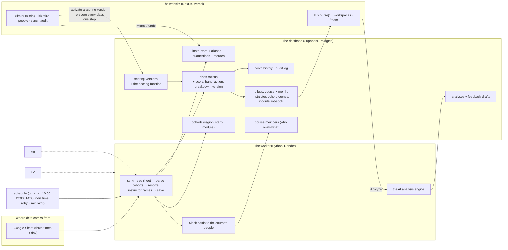
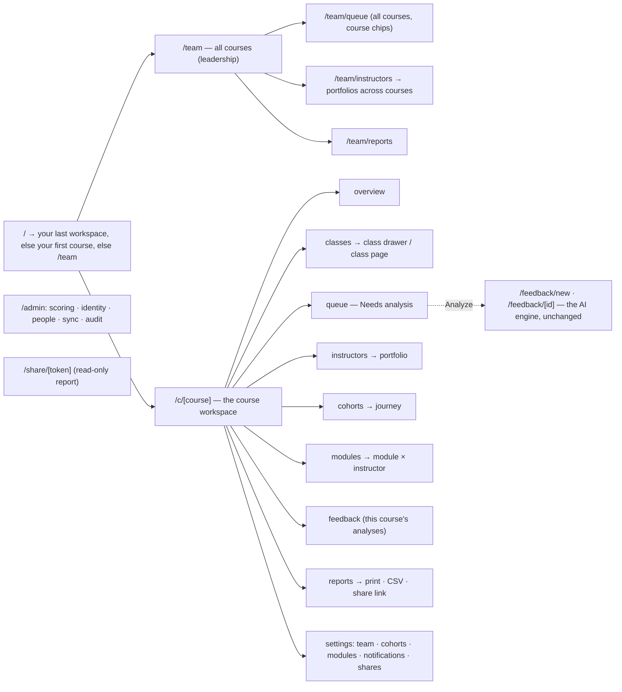

# How the Feedback Loop works — the full story, in plain English

> This guide explains everything the system does, top to bottom, with no technical knowledge
> assumed. Managers, PMs and the curious: this is written for you. Engineers get the exact names
> in `code`. Read it in order, or jump to a section.

**Contents**

1. [What this is, in one paragraph](#1-what-this-is-in-one-paragraph)
2. [The problem it solves](#2-the-problem-it-solves)
3. [The picture — who does what](#3-the-picture--who-does-what)
4. [Where things are in the app](#4-where-things-are-in-the-app)
5. [From the sheet to a scored class — the data pipeline](#5-from-the-sheet-to-a-scored-class--the-data-pipeline)
6. [The Class Sentiment Score](#6-the-class-sentiment-score)
7. [The queue — Needs analysis](#7-the-queue--needs-analysis)
8. [The course workspace, page by page](#8-the-course-workspace-page-by-page)
9. [The team level](#9-the-team-level)
10. [People and ownership — and the Slack cards](#10-people-and-ownership--and-the-slack-cards)
11. [Instructor identity — one person, one name](#11-instructor-identity--one-person-one-name)
12. [Changing the scoring — versions, preview, activate, roll back](#12-changing-the-scoring--versions-preview-activate-roll-back)
13. [Reports and sharing](#13-reports-and-sharing)
14. [The AI analysis engine (unchanged in v3)](#14-the-ai-analysis-engine-unchanged-in-v3)
15. [What is stored, who can do what, what it costs](#15-what-is-stored-who-can-do-what-what-it-costs)
16. [What is planned, not built](#16-what-is-planned-not-built)
17. [Glossary](#17-glossary)

---

## 1. What this is, in one paragraph

Feedback Loop is the New Programs team's website for class quality. Three times a day (10:00,
12:00 and 14:00 India time) it reads the team's ratings sheet, gives each class one score (the **Class Sentiment Score**, 0–100) and a
band (**Excellent · Good · Average · Bad**), and puts the classes whose band calls for a closer
look into a queue: Bad ones for a video analysis, Average ones for a transcript analysis. A PM
confirms, the AI reads the recording and drafts the instructor feedback, and the PM edits,
approves and sends it. Around that loop sit a workspace for every course, a team view for
leadership, instructor portfolios, cohort journeys, module hot-spots and reports — and the scoring
rules themselves are settings an admin can change, preview and roll back.

## 2. The problem it solves

Three problems, really:

1. **"How is this class doing?" had no shared answer.** Ratings lived in a sheet, every PM read
   them differently, and one "no" vote from three voters could look like a disaster. The score
   gives the whole team one language, with the arithmetic one hover away.
2. **Finding out *why* a class went badly took hours.** Watching a four-hour recording and writing
   kind, specific feedback is 2–4 hours per class. The AI does the watching and the first draft in
   a few minutes for well under a dollar; a person reviews, tweaks and approves.
3. **The same instructor appeared under several spellings, and cohorts were free text.** Every
   per-instructor and per-cohort figure was unreliable. Now spellings resolve to one person (with a
   human deciding the doubtful ones), and cohorts and modules are read from the sheet's own text.

## 3. The picture — who does what

```mermaid
flowchart LR
  subgraph SRC["Where data comes from"]
    GS["Google Sheet (three times a day)"]
  end
  subgraph WK["The worker (Python, Render)"]
    SY["sync: read sheet → parse cohorts → resolve instructor names → save"]
    NT["Slack cards to the course's people"]
    ENG["the AI analysis engine"]
  end
  subgraph DB["The database (Supabase Postgres)"]
    CFG["scoring versions<br/>+ the scoring function"]
    CR["class ratings<br/>+ score, band, action, breakdown, version"]
    ID["instructors + aliases + suggestions + merges"]
    CO["cohorts (region, start) · modules"]
    CM["course members (who owns what)"]
    V["rollups: course × month, instructor, cohort journey, module hot-spots"]
    HIST["score history · audit log"]
    AN["analyses + feedback drafts"]
  end
  subgraph WEB["The website (Next.js, Vercel)"]
    WS["/c/[course]/… workspaces · /team"]
    ADM["admin: scoring · identity · people · sync · audit"]
  end
  GS --> SY
  MB -.-> SY
  LX -.-> WK
  SY --> CR
  SY --> ID
  SY --> CO
  CFG --> CR --> HIST
  CR --> V --> WS
  ADM -- "activate a scoring version → re-score every class in one step" --> CFG
  ADM -- "merge / undo" --> ID
  SY --> NT --> CM
  CRON["schedule (pg_cron: 10:00, 12:00, 14:00 India time, retry 5 min later)"] --> SY
  WS -- "Analyze" --> ENG --> AN
```

| Helper | Plain-English job | Where it lives |
|---|---|---|
| **The website** | The screens you click: workspaces, the queue, the drawer, admin. It owns every read and write to the database, under row-level security. | Vercel |
| **Sign-in** | Google, restricted to `@interviewkickstart.com`. Locally, an email + password login also works. | Supabase Auth + Google |
| **The database** | The filing cabinet with locks. Classes and scores, the scoring versions and *the scoring function itself*, instructors and aliases, cohorts and modules, course members, analyses, the audit log. | Supabase (Postgres) |
| **The worker** | Two jobs in one small server: the ratings sync (three times a day, and the "Sync now" button), and the AI analysis engine. | Render (a Docker container) |
| **The ratings sheet** | The team's Google Sheet, read by a view-only "robot" account. Still the source; the app keeps a scored copy. | Google Sheets |
| **Slack** | Where a flagged class is announced to the course's people, and where a failed sync is reported. | Slack (a bot token) |
| **Vimeo** | The class recordings and their captions (the transcript). | Vimeo |
| **Claude** | The AI model that reads a class and writes the findings and the feedback. | Anthropic |

## 4. Where things are in the app

```mermaid
flowchart LR
  ROOT["/ → your last workspace, else your first course, else /team"]
  ROOT --> TEAM["/team — all courses (leadership)"]
  ROOT --> WS["/c/[course] — the course workspace"]
  TEAM --> TQ["/team/queue (all courses, course chips)"]
  TEAM --> TI["/team/instructors → portfolios across courses"]
  TEAM --> TR["/team/reports"]
  WS --> OV["overview"]
  WS --> CL["classes → class drawer / class page"]
  WS --> QU["queue — Needs analysis"]
  WS --> IN["instructors → portfolio"]
  WS --> CO["cohorts → journey"]
  WS --> MO["modules → module × instructor"]
  WS --> FB["feedback (this course's analyses)"]
  WS --> RP["reports → print · CSV · share link"]
  WS --> ST["settings: team · cohorts · modules · notifications · shares"]
  ADM["/admin: scoring · identity · people · sync · audit"]
  SHARE["/share/[token] (read-only report)"]
  QU -. Analyze .-> ENG["/feedback/new · /feedback/[id] — the AI engine, unchanged"]
```

**Where you land.** `/` sends you to the workspace you used last (remembered in a cookie), else to
the first course you are a member of, else — for an admin — to `/team`, else to the first course.
The identity block at the top of the left rail is the **course switcher**: *My courses* first,
then every course, with the team level pinned at the bottom (`⌘1`–`⌘9` jump to a course, `⌘0` to
the team). `⌘K` / Ctrl-K opens the command palette: any page, any course, an instructor, *Sync
now*, the theme.

**Old links.** `/feedback` still resolves to the person's course and its analyses list (a
`?course=` picks the course). The other pre-v3 URLs were retired in September 2026 along with
the study page, the What-if page and the 3D instructor view.

## 5. From the sheet to a scored class — the data pipeline

**When.** Three times a day, at 10:00, 12:00 and 14:00 India time, with a retry five minutes
after each in case the worker was asleep (Render's free tier sleeps when idle; a second run is
harmless because a sync that finds another one running just stops). A timer inside the database
(`pg_cron`, migrations 0027 and 0031) mints a single-use token and posts it to the worker's
`POST /sync-ratings/cron`; the worker spends the token before it starts, so no key is stored in
the database. The hours and the time zone are rows in `app_settings`. Any staff member can also
press **Sync now** (queue page, Admin › Sync, or `⌘K`).

**How much it does.** Every sheet row gets a fingerprint of its values, stored on the class row.
A run reads the whole sheet but writes only rows whose fingerprint changed, so an everyday run
takes seconds (a full rewrite, forced with `RATINGS_SYNC_FULL=1`, takes about eight minutes). A
row the sheet no longer has, typically because an instructor's spelling was corrected and a new
row took its place, is removed, unless a person acted on it; never more than a small share in one
run, and only inside tabs that actually returned rows. Week numbers are recomputed for every cohort
each run. A running sync reports a heartbeat every half minute; a run without one for ten minutes
is marked failed so the page never shows a ghost run.

**What is read.** The two default tabs (`MLSU_Live_Class_Poll` and `Agentic_AI_Live_Class_Poll`;
`RATINGS_SHEET_TABS` changes that), through a service account that can only *view* the one sheet
shared with it. Columns are found by their header name, so reordering or adding columns is
harmless; renaming a required one stops the run with the column named.

| Header in the sheet | Required? | Used for |
|---|---|---|
| `Session Date` | yes | the class date |
| `Type` | yes | Live Class vs Test Review, the region ("India …" → IND, else US), and a fallback for the course |
| `Cohorts` | yes | the course (matched by the cohort text) and the cohorts themselves |
| `Class` — or `Topic` on a tab that has no `Class` column | yes | **the class name.** On the Agentic tab `Topic` holds the session kind ("Live Class" / "Test Review Session") and `Class` the real name; reading `Topic` there had mislabelled two-thirds of all classes until 3 Sep 2026. |
| `Instructor` | yes | the instructor, as spelled that day |
| `Overall Average` | yes | the rating |
| `Responses` | yes | how many learners rated |
| `# Students Attended` | yes | how many attended (for the reach) |
| `Yes` / `No` | optional | the approval vote — "would you want this instructor to take the class again?" A tab without them still syncs; those classes carry no vote. |

**What happens to each row**, oldest first:

1. **The course** is read from the cohort text (first match wins: "pwc" → the PwC course,
   "applied agentic ai" → Applied Agentic AI, and so on), falling back to the `Type`. A label the
   app does not know stays *unmapped* until someone maps it to a course (Admin › Sync).
2. **The cohorts** are parsed from the same text. One cell often glues several labels together,
   separated by commas or semicolons, each shaped like
   *Program - [IND ][2nd ]Early|Mid|End-Month Year[ : Cohort n]*. From it the app reads the
   region, the intake window (start month, early / mid / end), the ordinal ("2nd"), the cohort
   number and the audience (SWE / Tech / PM / EM). Junk labels (placeholder, template, deprecated,
   DNU, test cohort…) are dropped. A class can belong to several cohorts; what cannot be parsed is
   counted, never fatal.
3. **The instructor** is resolved to a person **only by exact normalised spelling** — lower-case,
   accents removed, punctuation stripped, spaces collapsed — through the `instructors` table and
   the `instructor_aliases` table. Anything else stays *unresolved* and becomes a suggestion for a
   human (section 11). The resolved display name is stored on the row as `instructor_canonical`.
4. **The module** (the app calls it a *topic*) is resolved through `topics` and `topic_aliases`
   per course; a class name the table has never seen becomes a new topic.
5. **The row is saved and scored in one statement.** The save calls the database's scoring
   function with the active scoring version and the course's typical values, and stores the score,
   the band, the action (stored as video / transcript / none / watch; shown as watch the recording /
   read the transcript / nothing needed / too few responses), whether it rests on very few
   responses, the flags,
   the full breakdown and the version that produced it. The queue's `decision` follows the action
   — unless a PM has frozen the row (a manual override, a dismissal, an analysis already started,
   or an escalation, which is always video).

Rows are matched on their natural key (date + class name + instructor + kind), so re-running a
sync updates rows in place and never duplicates them.

**After the loop**, the run writes duplicate-name suggestions for the unresolved spellings, turns
unknown class names into topics, posts the Slack cards (section 10), records itself in
`sync_runs` (rows fetched, upserted and scored, the scoring version, the band counts, cohorts
created and unparsed, unresolved names, suggestions created, unmapped topics, duration, any error)
and pings the website so every page shows fresh rows. A failed run is recorded *and* posted to the
Slack channel, so a drifting sheet is noticed the same hour.

**For one more release** the sync also writes the previous rule's read-out (`approval_pct`,
`track_avg`, `health_score`, `health_band`, `flag_reasons`, and a one-time `decision_v2`
snapshot) so the two rules can be compared side by side. Nothing else reads them.

**Without the Google key** (a laptop that has the workbook but not the robot account), the same
path runs from the local workbook copy: `analysis/resync_from_workbook.py --check` compares,
`--run` backs the database up and syncs, with Slack switched off.

## 6. The Class Sentiment Score

One number per class, 0 to 100, two decimals, and a band read from it:

| Band | Score | What it means | What happens |
|---|---|---|---|
| **Excellent** | 90 and up | clears every bar with room to spare | nothing, unless a PM asks |
| **Good** | 75 – 89.99 | fine on both lines | nothing, unless a PM asks |
| **Average** | 60 – 74.99 | one line missed — worth a transcript read | transcript analysis |
| **Bad** | under 60 | both lines missed, or the score itself is under 60 | video analysis |
| *(no band)* | — | too few responses to judge (fewer than 6) | watch |

Every band → action mapping, every weight and every bar below is a **setting of the active scoring
version** (section 12). The descriptions here explain the machinery; the exact numbers in force
are whatever the version marked **Active** on Admin › Scoring says, and the queue page names that
version in its filter bar.

### What goes in

Five things about the class, from the sheet:

- **Rating** — the class's average star rating (out of 5).
- **Approval** — the share of voters who said *yes* to "would you want this instructor to take the
  class again?" (from the `Yes` / `No` columns).
- **Responses** — how many learners rated.
- **Reach** — the share of attendees who rated (responses ÷ attended, capped at 100%).
- **Track record** — the instructor's average rating over earlier classes (it needs at least
  three earlier classes to count).

Plus two things about the course, used by the small-sample guard: its typical rating and its
pooled approval. And whether a PM has **escalated** the class.

### How the parts become points

Each part is turned into a 0–100 value, then weighted. A version chooses, for each part, *how*:

| Part | The choices a version can make |
|---|---|
| Rating | **linear** (rating ÷ 5) or a **knee**: 0 at a floor (3.55), a set value at the line (4.55), 100 at 5 — so points fall faster below the line |
| Approval | a **cliff** (all the points at or above the bar, 80%, none below) or **graded** (0 at 40%, rising to all the points at 80%) |
| Responses | a **cliff** at the target (10), **graded** (responses ÷ target), or **off** |
| Reach | **graded** (the share itself) or **off** |
| Track record | **on** (0 at a floor of 4.05, 100 at 4.55) or **off** |

The weights say how many points each part is worth. Only parts that are *included* count: a part
that is switched off, or missing and set to "neutral", is left out and the remaining weights are
re-scaled so the total still reads out of 100. A part that is missing and set to "zero" scores
zero for its weight (version 1 does this for a missing vote and a missing attendance).

The result is rounded to two decimals, and **the band is read from that rounded number** — so what
you see on the screen is exactly what drives the queue.

### The safeguards a version can switch on

- **Minimum responses.** Two floors: below the first, no band is shown at all ("— · too few
  responses"); below the second, a band is shown but marked *based on very few responses* and the
  class goes to *watch* rather than to an analysis. **The live version sets both at 6**, because a
  percentage of three people is not evidence that a class went well or badly.
- **The low-rating exception.** Even with too few responses, a class rated below the line the team
  set (**4.3**) is banded Average so its transcript is read: a low rating is worth a look whatever
  the head-count.
- **The rating floor.** A class rated below **4.3** can never sit above Average, however good its
  approval: the VP's rule that a low rating always earns at least a transcript read.
- **The small-sample guard.** With few votes, the class's rating and approval are blended with the
  course's typical values (weight *k*, typically 5), so three opinions cannot sink a class on their
  own; once a class has ten or more votes its own numbers dominate.
- **The hard lines.** Under the version's rating line (4.55 in the original design, 4.3 in the
  live version), or under the 80% approval bar (with enough responses to count), the band can
  never sit above **Average**; missing both makes it **Bad**, whatever the score says.

### The action

The band picks the action from the version's mapping (today: Bad → video, Average → transcript,
Good and Excellent → none, no band → watch). Two overrides: an **escalated** class is always
*video*, whatever its numbers; and a band that rests on very few responses goes to *watch*.

### The flags

Alongside the score the database stores plain flags, shown in words on the class drawer and the
Slack card: *no approval answer recorded*, *nobody responded*, *attendance is missing*, *more
learners rated than attended (capped at 100%)*, *the rating and the instructor approval
disagree*, *few responses — blended with the course's typical values*, *no track record yet*,
*rated below the line the team set*, *instructor approval below the bar the team set*, *too few
responses for a band*, *too few responses to judge, but rated below 4.3, so the transcript is
read*, *escalated by a PM*. Negative or nonsense numbers are rejected: no score, no band, *watch*.
A flag the website does not know is left out of the list rather than shown as a code.

### The stored versions

| Version | Name (as stored) | What it changes against version 1 |
|---|---|---|
| **1** | Manager's original (60/30/6/4, pass/fail) | The baseline: rating ÷ 5 for up to 60 points; approval 30 points all-or-nothing at 80%; responses 6 points all-or-nothing at 10; reach up to 4 points; a missing vote or attendance scores zero; no minimum votes, no guard, no hard lines. |
| 2 | Original + minimum votes | The same, but a class needs 5 votes to show a band and 5 to trigger an analysis. |
| 3 | Graded approval | Approval earns its points gradually from 40% to 80%; a missing vote is left out rather than scored zero. |
| 4 | Graded + small-sample guard | As 3, plus graded responses, the guard (k = 5), a band from 3 votes and an analysis from 5. |
| 5 | Data-derived weights | The rating knee, graded approval, responses and reach switched off, the track record on; weights 60 / 25 / 15; guard k = 5; 3 / 5 votes. |
| 6 | Two lines + graded score | As 5, plus the two hard lines (4.55 and 80%). |
| 7 | Recommended · validated on Jan–Aug 2026 | Version 6 without the small-sample guard, the candidate the study recommended. Retired after the formula test. |
| 8 | Original + the 4.3 rating floor | The manager's original with one hard line: rated below 4.3 can never sit above Average (Sreejit's rule, September 2026). Retired. |
| 9 | 4.3 floor + approval counts from 6 answers | As 8; below 6 approval answers a passing approval added no points. Retired the same day: a "no" from 1 of 3 still sent a 4.67 class to video. |
| **10** | **4.3 floor + too few below 6 responses** | **Live.** As 8, and a class with fewer than 6 responses gets no band and no automatic analysis, unless it is rated below 4.3, in which case its transcript is read. |

Versions 1 to 6 are seeded by migration 0015 from `supabase/fixtures/scoring_configs.json`; 7 to
10 were created on the scoring page. **Version 10 is active.** The formula test that settled the
choice ran twelve real classes through the candidates with the verdicts written down before the
results existed; Karthika's original weights won, and the two September rules were added on top. The **validation study**
(`analysis/sentiment_run_all.py` → `Sentiment-Score-Validation.pdf` and the two-page
`Sentiment-Score-One-Pager.pdf`, shared separately because they carry instructor names) replays
eight months of real classes through all six and recommends which to activate. Whatever the team
decides, the version marked **Active** is the one in force.

### Where you see it

One component draws every score: **number + band label, always** — colour only reinforces. A 4-px
band bar sits underneath. Hover or focus shows the breakdown: each part, what was measured, the
points earned out of the weight, the version, and what the rule says. Averages (a course, an
instructor, a cohort, a module) are drawn **outlined and say "avg"**, so an average is never
mistaken for a class score. A class with no band shows **"— · too few responses"**, never a fake
number. The same score appears in the classes table, the drawer, the queue, the portfolios, the
reports, the CSV export and the Slack card.

### Two worked examples

*Under version 1.* A class rated **4.30**, **9 of 12** voters would have the instructor back
(75%), **12 rated of 30 attended**:

| Part | Measured | Points |
|---|---|---|
| Rating | 4.30 / 5 | 51.60 of 60 |
| Approval | 9 of 12 · 75% (bar 80%) | 0 of 30 — under the bar, the cliff gives nothing |
| Responses | 12 rated (target 10) | 6 of 6 |
| Reach | 12 of 30 · 40% | 1.60 of 4 |
| **Score** | | **59.20 → Bad → video analysis** |

*The same class with 11 of 12 saying yes (92%)* scores 89.20 under version 1 → Good → no analysis:
the 4.30 rating is hidden by the approval points. Under version 6 the rating is under the 4.55
line, so the band is capped at **Average → transcript** however the points add up. That difference
— which low-rated classes get read, and which do not — is exactly what the validation study
measures, and why the settings are versions rather than code.

### One source of truth

The scoring function lives **in the database** (`score_class_rating()` in migration 0015), so a
change of version re-scores every class in one statement, in seconds, without the worker being
awake. The website carries a copy (`web/src/lib/sentiment.ts`) used only for live previews, and
the study uses the Python reference (`analysis/sentiment_score.py`). All three must reproduce the
same 94 cases in `supabase/fixtures/scoring_cases.json` — the manager's worked examples plus every
edge case we could think of (nobody attended; one attendee who rated 5.0; a 200-person webinar
with five happy raters; a big room saying no; ratings but no vote; more raters than attendees;
approval exactly 80.00 and 79.99; every band edge; an instructor's first class; a source with no
vote column; nonsense values) — and tests on all three sides pin that: `npm test` (107 tests),
`supabase/test_scoring_sql.py`, and `analysis/test_sentiment_score.py` (the 44 edge cases).

## 7. The queue — Needs analysis

One page for a course (`/c/<course>/queue`) and one for the whole team (`/team/queue`, with a chip
per course), in three sections:

- **Bad → video**
- **Average → transcript**
- **Watch** — classes with fewer responses than the version's analysis floor (no band, or one
  that rests on very few responses).

Under every row, the reason in plain words — *"Rated 4.31 · 7 of 16 would have the instructor back
(44%) → Bad → video analysis."* — and the flags. At the top, **the week's cost**:
*"5 videos · 9 transcripts ≈ $8.09 · ~1.1 h"*, from $0.70 per video and $0.51 per transcript
analysis, and about 7 and 3.5 minutes of a PM's time each. The filter bar (kept in the URL, so a
filtered view is a shareable link) has the period (default the last 45 days), cohort, live vs
review, instructor and status; the default status is *open* (new · handler pinged · confirmed).

Each row's actions:

| Action | What it does |
|---|---|
| **Analyze** | Opens the New analysis form prefilled with the class (course, name, instructor, date, kind, rating, votes). The engine is unchanged (section 14). |
| **Confirm** | "Yes, this class should be analysed" — the handler's acknowledgement of the Slack card. |
| **Dismiss** | "No analysis needed." The row fades out and no later sync re-opens it. |
| **Escalate** | Forces the video verdict whatever the numbers say, and re-opens the row. |

A class moves through *new → notified (the Slack card went out) → confirmed → analysis started*,
or to *dismissed*. Everything a PM does here is written to the audit log.

## 8. The course workspace, page by page

Everything under `/c/<course>/…` is that course only; its colour square and name are on every
page, and the filter bar (period · cohort · live/review · instructor · band) is kept in the URL.

**Overview.** A KPI row — classes rated, average score, the band mix, approval (against the 80%
bar), reach, the open queue — each against the previous period of the same length. Then *Score by
week* (with the four band zones shaded), *Band mix by week*, *Worst classes* (a row opens the
class), *Instructors* (three or more classes, with a bullet against the course average), *Live vs
review* ("is it the class or the review?"), *Module hot-spots*, *Cohorts* as small multiples,
*Score against how many learners rated* ("is a low score just a few people rating?"), and a *Calendar* of the average score per
day ("do bad classes cluster on certain days?").

**Classes.** Every class in the period, scored, 50 to a page, sortable, with a compact-density
toggle. Clicking a row opens the **drawer** on the right — the URL gains `?class=<id>`, so a
drawer is a link you can send; the same content is also a printable page of its own
(`/classes/<id>`). The drawer shows: the score hero and a 0–100 bullet with the band zones; what
the rule says and why, in one sentence; the flags; **What the score is made of** (each part, what
was measured, the points); **The room** (the vote and the reach); the instructor's recent classes;
**This module** (the module's average); **Actions** (Analyze · Confirm · Dismiss · Escalate); the
**History** of the class's score across versions and the Slack pings; and the link to the AI
analysis when one exists.

**Instructors.** The leaderboard (instructors with three or more classes, sorted best, worst,
most classes or recent; delta against the previous period; a bullet against the course average),
and, below it, those with fewer classes. A name opens the **portfolio**: the header (the
canonical name and *"also recorded as …"* for the other spellings, classes, average score, band
mix, approval, reach, against the course), *Score trend* (weekly, grey = the course, a marker on
each week AI feedback was sent), *Modules* (this instructor's module scores against the course's
module averages), *Monthly approval* against the 80% bar, *The four boxes* (fine on both lines /
polite rating / hard class, good teacher / fails both), *Best five* and *Worst five* classes, and
*AI feedback* — every note sent, with the average of the next three classes.

**Cohorts.** The **curriculum map**: one row per cohort, one column per module in curriculum
order (the median cohort week each module is taught in); every cell shows the raw rating over
*rated / attended*, tinted by band (or by rating, attendance against the cohort's first class, or
reach — a toggle). The period picks which cohorts appear; each cohort is then drawn over its
whole run, so earlier modules are never blank. A course with parallel tracks (SWE, EM, PM …) is
read one track at a time. The footer row carries each module's average rating and room and the
fall in attendance against the module before it. An **Insights** strip turns the map into
sentences (largest attendance drop, largest rating dip, modules low across several instructors,
the instructor who teaches a weak module above its average), each a link. Then *Attendance along
the course* and *Rating along the course* (one line per cohort, the median in bold) and the cohort
table (avg score, avg rating, avg attended, reach, retention). A cohort opens its journey: avg
attended and retention beside the score, *The journey* (live and review, band zones, the
reference from earlier cohorts of the same audience), *Attendance and reach by week*, and every
class as a sortable table.

**Modules.** Every module with two or more classes, in curriculum order, with the raw numbers,
the change in attendance and rating against the previous module, a tag — **content** (low across
two or more instructors: the material) or **delivery** (low for one of several: the teaching) —
**Teaches it best** and **Struggles with it** (instructors against the module's average), and
the band mix; the **Module × instructor** matrix switches between rating, attendance and score.
A module opens its own page: *By instructor* (who lifts it, who needs coaching), *Rating by
cohort* (a module that got fixed shows there), *Every class*.

**Sorting and raw numbers.** Every table sorts by any column (a click on the heading; nulls
last); card grids and the queue have a *Sort by* control. Wherever a class, instructor, cohort or
course is listed, the score pill is followed by the raw numbers — rating, rated / attended — so
the room behind a score is always in view.

**Feedback.** This course's AI analyses — status, re-teach call, cost — and the *New analysis*
button, which carries the course into the engine.

**Reports.** Section 13.

**Settings.** Five tabs. **Team**: who is on the course, their role (Owner · PM · Viewer) and
scope (whole course or one cohort), who the handler is, *Add by IK email*, *Hand over to…* (with
a note that goes into the audit trail), remove. **Cohorts**: rename. **Modules**: map every raw
class name to a module once — it sticks for every sync. **Notifications**: Slack on or off per
person (a person can always change their own). **Shares**: the read-only report links for this
course. Owners and admins edit; everyone else reads — course is a label, not a wall.

## 9. The team level

`/team` is for leadership: **every course at once**. A housekeeping line first — last sync,
unmapped sheet labels, courses without a handler, duplicate names waiting — each with a link to
the page that fixes it. Then a card per course (average score, band strip, a 12-week sparkline,
the change against the prior 30 days, the open Bad / Average counts, the handler), sorted by the
share of Bad classes; *Every course, one axis* (small multiples against all courses in grey);
*Instructors that moved* and *Modules that moved* month over month; the *Course × month* matrix;
*Queue capacity* per course (videos, transcripts, cost, backlog age); and *Is the loop closing?*
— flagged → confirmed → analysed → approved → sent over the last 30 days, with days per step.

`/team/queue` is the same queue across every course with a chip per course. `/team/instructors`
is the directory across courses. `/team/reports` is the report across courses. (The live study
page, the 3D instructor view and the What-if page were removed in September 2026: research
views nobody used day to day.)

## 10. People and ownership — and the Slack cards

One table, `course_members`, says who owns what: a person by IK email (linked to their login the
first time they sign in), a course, a role (**owner · pm · viewer**), an optional cohort (a
member scoped to one cohort), the **handler** flag — exactly one handler per course, enforced by
the database — Slack on or off, who added them, and the hand-over history. Course owners and
admins edit a course's team; admins see the whole **people × courses** matrix on Admin › People,
along with each course's identity (one of eight colours and up to three initials, used only for
the identity square) and every share link.

**Hand-over.** *Hand over to…* on the Team tab makes another member the handler, records who it
came from and when on their row, and writes an audit row with the note. Slack routing follows on
the next sync.

**The Slack card.** After every sync, each newly flagged class (video or transcript, still *new*,
mapped to a course, never pinged before) gets one card in the team's Slack channel. It leads with
the score — *"Sentiment 58 · Bad → video"* — then the course and class, the date, the instructor
(with *"recorded as …"* when the sheet's spelling differs), the rating and how many rated, the
vote, *why* in plain words (the flags), *rule says* video or transcript, and a **Review in
Feedback Loop** button that opens the course's queue with that class in focus. The card
**mentions the course's people**: every member with Slack switched on, the handler first, and
members scoped to a cohort only for that cohort's classes. A course with nobody on it gets a card
that says *"No owner assigned — set one in Admin › People"*. (Only when a course has no members at
all does the card fall back to the older handler table.) Two guard rails stop a flood: only classes
from the last 10 days are pinged, at most 25 per run (both are settings). A failed sync posts a
warning to the same channel. Confirm and Dismiss live in the app, not on the card.

The **weekly digest** to every member is designed but not built yet (section 16).

## 11. Instructor identity — one person, one name

The sheet spells the same person several ways — "Jane Smith", "Jane", "jane smith", "Dr. Jane
Smith", "Jane Smiht". Until those resolve to one person, every per-instructor figure is wrong.

- **Normalisation** is the exact rule on both sides (the worker and the database): lower-case,
  accents removed, everything but letters, digits and spaces stripped, spaces collapsed. Two
  spellings that normalise to the same string are the same person, automatically.
- **Aliases.** `instructor_aliases` maps any spelling to one instructor. The sync resolves through
  it and links every class row it can; what it cannot, it counts as *unresolved*.
- **Suggestions.** After every sync, the matcher scores each unresolved spelling against every
  known instructor — identical once honorifics and doubled words are removed; the same first name
  where that first name belongs to exactly one instructor; one name a prefix of the other;
  initials; a one-letter typo; plus a bonus when the candidate taught the same course within four
  months, and a penalty when both names taught different sessions on the same day (probably two
  people). Anything scoring high enough becomes a suggestion with its evidence.
- **Admin › Identity** has three panels. *Suspected duplicates*: each suggestion side by side
  (classes, first and last dates, average, top modules), **Accept** or **Not the same person**
  (never suggested again), and *Accept all* above a confidence you choose. *Unresolved names*:
  **Link to an existing instructor**, or create a new instructor from the spelling. *Instructors*:
  the directory, **Merge this (duplicate) → Into this (keep)** with a preview of what moves, and
  the recent merges with **Undo**.
- **Merges are soft and reversible.** The duplicate row is kept, the spelling becomes an alias of
  the survivor, every moved row id is stored, and *Undo* replays it in reverse. The page offers
  Undo for 30 days.
- **A merged identity flows through everything**: the classes table, the leaderboard, the
  portfolio (whose header lists *"also recorded as …"*), the track record used by the score, the
  Slack card, and the engine's instructor autocomplete.

## 12. Changing the scoring — versions, preview, activate, roll back

`scoring_configs` holds every version: a number, a name, a key, a note, the settings, who
created it, when, and a status — **draft**, **active** (only one at a time, enforced by the
database) or **retired**. Every stored class score carries the version that produced it, and
`class_score_history` records a row whenever a class's score, band or version changes.

**Admin › Scoring** is one screen in two halves. On the left: what to start from (the active
version, any stored version, or the two presets — the manager's original and *Two lines + graded
score*), the draft's name, key and note, and every setting: the rating scale, the approval mode
and bar, the response target, rated ÷ attended, the track record, the weights, the guard, the
response floors,
the hard lines, the band edges, what a missing input does, and the band → action mapping. On the
right: **the live preview** over a chosen month or range of real classes — the band mix before
and after, *Classes that change band*, *Analyses per week* (video and transcript, and the cost per
week), *Dropped from today's queue*, *Flip on one vote* (the share of classes whose band would
change if one learner voted differently, also for classes with ten or more votes), and the list of
every class that moves. *Compare with the database* asks Postgres to compute the same summary
(`scoring_whatif_summary()`), so the browser's mirror and the database are checked against each
other.

The buttons: **Save draft**; **New draft from this version**; **Publish this version** (a name
and a note are required — the note goes into the audit trail; the confirm button reads *Publish
and re-score*); on a retired version, **Roll back to this**; **Delete** (drafts only). Publishing or rolling back calls `apply_scoring_config()`: the previous
version is retired, the chosen one activated, **every class re-scored in one statement**, the
history rows written, an audit row recorded (`scoring_published` or `scoring_rolled_back`), and
every page refreshed. The queue's `decision` follows the new action on every row a PM has not
frozen.

## 13. Reports and sharing

Per course (`/c/<course>/reports`) and across the team (`/team/reports`): **Weekly**, **Monthly**
or **Custom**, with previous / next period arrows. The page holds the headline tiles (classes
rated, average score, band mix, approval, reach, flagged — each against the previous period),
*Score vs the previous period*, *Instructors that moved* and *Modules that moved*, the *Worst
classes* with what happened to each, the instructors, the cohorts, the modules (lowest first),
and *Loop outcomes* (flagged → confirmed → analysed → approved → sent, with the median days per
step). The team report adds a table of every course.

Three ways out:

- **Print / Save PDF** — the browser's print, with A4 page breaks between sections and the chrome
  hidden. (A server-rendered PDF is planned; today the PDF comes from your browser.)
- **CSV** — every scored class in the period: date, course, cohort, kind, class, instructor (and
  the spelling as recorded), rating, rated, attended, rated ÷ attended (`reach_pct`), the yes and
  no answers, approval, score, band, action, whether it rests on very few responses
  (`provisional`), which version scored it, the review status, and the reason.
- **Share** — a read-only link (`/share/<token>`): an unguessable token, an expiry (30 days by
  default, up to a year), revocable by its creator or an admin from the course's Shares tab or
  Admin › People. The page behind it shows the headline tiles, the band mix, live vs review, the
  lowest classes, and the instructors — no filters, no actions, no drawer — and still requires an
  IK sign-in.

## 14. The AI analysis engine (unchanged in v3)

Everything from the queue's **Analyze** button onwards is the engine the team already uses. The
exact prompts are in [THE_AI_ANALYSIS_PROMPTS.md](THE_AI_ANALYSIS_PROMPTS.md); this is the plain
version.

**The journey of one class.** The form arrives prefilled from the queue (course, class name,
instructor, date, kind, rating, the votes) — or you fill it by hand. You give it the recording:
the class's **Vimeo link** (from UpLevel: *Resources → Videos → the class → Basic Details → VIMEO
URL*) or an uploaded transcript file; optionally tick **Analyze the video too**; optionally attach
the **class materials** (upload, paste text, or paste a Google Drive / Docs / Slides link). Click
**Analyze class**. The website hands the job to the worker, which runs it in the background and
writes the finished analysis to the database; the page refreshes itself. Transcript-only takes
3–4 minutes, with video 6–8. A failed run is marked failed with the reason; a stalled one is
detected; both offer one-click **Retry**.

**How it reads a class.**

1. *The materials agent* converts slides, notebooks or docs into a clean outline of what was
   planned, so the analysis can say "slide 14's topic was never taught".
2. *The session map*: Claude reads the whole transcript once — who is the instructor, who are the
   learners, the real order of topics, which doubts were answered later. Nothing is judged out of
   context.
3. *Per 30-minute window* (with the map in hand): who is speaking, then only concrete
   **instructor** issues it can prove with a quote and a timestamp. A learner's confusion is never
   the instructor's flaw; a doubt answered later is a doubt handled well.
4. *Combine and verify*: findings are merged and each is dropped if the quote does not support it,
   the speaker was a learner, or the concern is resolved elsewhere.
5. *Write*: the overall summary, the list of flags with severity, the short note for the
   instructor, the detailed internal version, and the PM-only "should this class be re-taught?"
   call.
6. *The self-check*: a second, deliberately sceptical pass tries to refute every serious finding —
   is the quote real, is it really the instructor, does the rest of the session contradict it,
   does the evidence meet the bar for that severity? Findings are confirmed, softened or removed
   by fixed rules, and every decision is shown on the review page. "Critical" has to be earned.

**Watching the video** (optional per class): about one frame every 2–3 minutes, streamed from
Vimeo and never stored; a neutral observer notes camera on or off, screen shared or frozen, slides
or a notebook on screen, slide titles. Those become facts ("camera off from 00:14 to 00:31") the
transcript could never give. If the video cannot be read, the analysis continues transcript-only
and says why. Setup for plain Vimeo links: [VIMEO_VIDEO_ACCESS.md](VIMEO_VIDEO_ACCESS.md).

**Two checklists**: 14 points for a **live class** (pace, clarity, structure, examples,
correctness, agenda coverage, coding time, doubt handling, engagement…), 17 for an **assignment
review session** (every problem covered, solutions walked through not read out, the reasoning
taught, complexity and edge cases, common mistakes, doubts cleared).

**Two outputs**: a **short note to send the instructor** — one opening line with the rating, then
at most four or five bullets, each one specific error and its **Fix**, no timestamps, no
transcript quotes; and the **detailed, timestamped analysis for the internal team**, kept in-house
for coaching. On the review page the note is marked *Send this*; the badges say how the class was
analysed (*Video verified · N frames* or *Transcript only*, and *Self-checked*), and *Watch
recording* jumps into the video to check any flag yourself.

**Review, approve, send.** Edit the text directly, or tell the AI what to change ("warmer",
"focus on the skipped problems") and click **Revise**. **Approve & store** keeps your edits beside
the original; copy the note, send it the way you normally do, then **Mark as sent** so the whole team
sees *Sent to instructor ✓* — and the loop funnel on the reports counts it.

The model is Claude Sonnet 5; the engine asks for strict, schema-checked answers, prefers
silence to a false criticism, and anchors every point to a verbatim quote and a timestamp.

## 15. What is stored, who can do what, what it costs

| Thing | Stored? | Notes |
|---|---|---|
| Every rated class from the sheet (course, cohort text, class name, instructor, date, kind, rating, responses, attended, the vote) | ✅ Yes | A scored copy of the sheet, in the locked database. |
| The score, band, action, flags, breakdown, version — and the history of changes | ✅ Yes | So before and after can be compared, and a rollback is honest. |
| Instructors, aliases, suggestions, merges; cohorts; modules; course members (IK email, Slack user id) | ✅ Yes | The identity and ownership layers. |
| The analysis result, the feedback drafts and your edits | ✅ Yes, **kept for at least two years** | The point of the tool. Nothing deletes them; the instructor pages read all of it. |
| The transcript | ⏳ Yes, then **auto-deleted after 20 days** | A scheduled job wipes old transcripts. |
| **Uploaded materials and video frames** | ❌ **Never** | Read once in memory for that analysis, then discarded. |
| Share links | ✅ The token, the period, the expiry, who made it | Revocable; the page needs a staff sign-in. |
| The `kb` export views | ✅ Read-only views of the analyses and scores | For other teams' knowledge bases, through a role that can read nothing else ([B2B_DATA_ACCESS.md](B2B_DATA_ACCESS.md)). |
| Every meaningful action (activations, merges, hand-overs, confirmations, dismissals, share links…) | ✅ The audit log | Admin › Audit, filterable by action. |
| Anything on GitHub | ❌ No confidential data | The code and these docs only. The workbook, the study PDFs and Word documents, key files and `.env` files are gitignored. |

**Who can do what.**

| Role | Can |
|---|---|
| **Staff — PM** (any IK sign-in) | Read every course; the queue's actions; run, review and approve analyses; create and revoke their own share links; map an unmapped sheet label; press Sync now. |
| **Course owner** (a membership role) | Everything a PM can, plus edit that course's settings: team, handler, hand-over, cohorts, modules, notifications. |
| **Admin** | Everything, plus Scoring (publish, roll back), Identity (accept, merge, undo), People (the matrix, course identity, all share links), Sync, Audit. |
| **Learner** | Reserved for the future; sees nothing of the ratings. |

Access is enforced by the database's row-level security, not just by the screens; since
migration 0021 the ratings tables are readable by staff only.

**What it costs.** Measured on real classes: about **$0.51** per transcript analysis and
**$0.70** with video; a short review session costs less, materials add a little. The queue shows
the week's total before anyone starts. The website, the database and the worker run on the free
tiers of Vercel, Supabase and Render today; the sheet is read through a free service account.

**Outside services.** Vercel (the website) · Supabase (Postgres, sign-in, the schedule via
`pg_cron` and `pg_net` with single-use tokens, no stored secret) · Render (the worker) · Google
(sign-in restricted to IK; the Sheets API through a view-only service account) · Slack (a bot
token, one channel) · Vimeo (recordings and captions) · Anthropic (Claude) · GitHub (the code).

## 16. What is planned, not built

Designed in the v3 plan and left for the next release. None of these exist in the app today:

- **The two automatic reports.** A leadership report (all courses) and a team report (one
  chapter per course) are built (`ratings_module_build_kit/reports.py`) and run from the command
  line; scheduling them monthly and yearly to Google Drive and Slack waits on a Drive folder and
  a Slack bot.
- **The weekly Slack digest** to every course member (the routing table is in place).
- **Per-course scoring overrides** (one version applies to every course).
- **A TA-quality view** from the sheet's TA tab.
- **The bump chart** (rank by month).
- Validating the manager's other two sheet models (Instructor Insight risk labels, Topic Fit)
  with the same yardsticks as the score.

## 17. Glossary

- **Class Sentiment Score** — the 0–100 number every class gets, from the rating, the instructor
  approval, the responses, rated ÷ attended and (in some versions) the instructor's track record.
- **Band** — Excellent (90+), Good (75–89), Average (60–74), Bad (under 60), read from the
  rounded score. **No band** = too few responses.
- **Action** — what the band calls for: watch the recording, read the transcript, nothing needed,
  or too few responses (watch).
- **Too few responses** — fewer than 6 learners answered; no band is shown and nothing is analysed
  automatically, unless the class is rated below 4.3.
- **Based on very few responses** — a band shown from fewer responses than an analysis needs; the
  class is watched.
- **Instructor approval** — the learners' Yes / No to "would you want this instructor to take the
  class again?"; the bar is 80%.
- **Rated ÷ attended** — the share of learners who attended that also rated (responses ÷ attended).
- **Responses** — how many learners rated; the target in the original method is 10.
- **Track record** — the instructor's average rating over earlier classes (three or more).
- **Small-sample guard** — blending a class with few responses toward the course's typical values
  so a handful of opinions cannot decide a band on their own (off in the live version).
- **Hard lines** — under the rating line (4.3 live) or under 80% approval caps the band at Average;
  both → Bad.
- **Scoring version** — one stored set of every scoring setting; draft, active or retired.
- **Queue** — the *Needs analysis* page: Bad → watch the recording, Average → read the transcript,
  Watch → too few responses.
- **Escalate** — a PM forcing the video verdict.
- **Handler** — the one person per course a flagged class is addressed to first.
- **Owner · PM · Viewer** — the three membership roles on a course.
- **Alias** — a spelling that resolves to one instructor. **Suggestion** — a probable alias
  waiting for a human. **Merge** — folding one instructor row into another, undoable.
- **Cohort** — one intake of learners, parsed from the sheet's cohort text (region, start month,
  early / mid / end, cohort number, audience). **Module** (topic) — the canonical class name.
- **Workspace** — a course's own set of pages under `/c/<course>/…`; the team level is `/team`.
- **Sync run** — one pass of the worker over the sheet, recorded with its counts.
- **Share link** — a read-only, expiring, revocable link to a report.
- **Transcript** — the text of everything said in the class, from the Vimeo captions.
- **Worker** — the small server that runs the sync and the AI engine.
- **Rubric** — the fixed checklist the AI grades a class against. **Flag** — one issue the AI
  found, with a timestamp and a quote. **Re-class** — the AI's private opinion on whether a
  class should be re-taught; never shown to the instructor.
- **RLS (row-level security)** — the database's built-in locks that decide who can read what.
- **Migration** — one numbered SQL file that changes the database; v3 adds 0015 → 0023.

---

*Last updated for v3, 7 September 2026. Keep this in step with the app as it grows.*
