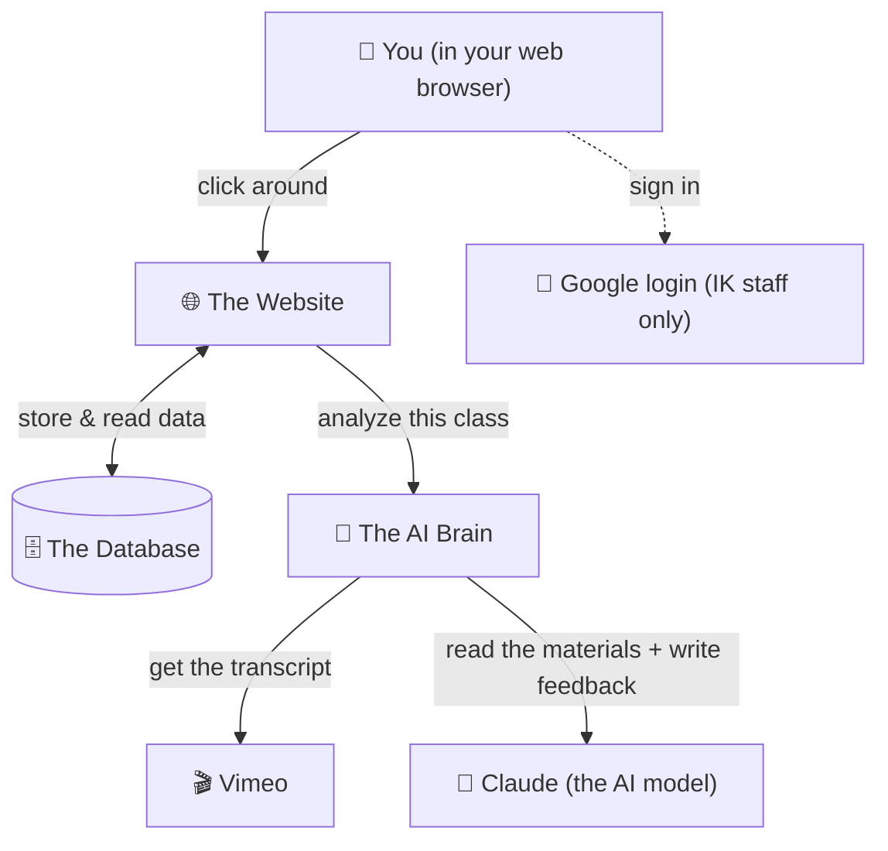
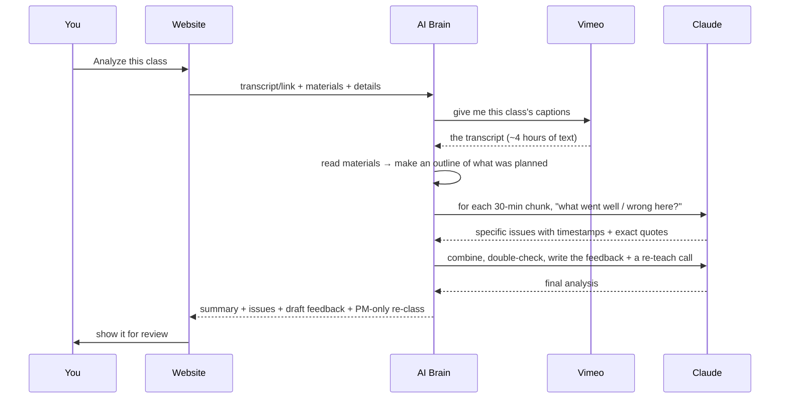

# How the Feedback Loop works — the full story, in plain English

> This guide explains **everything** the system does, top to bottom, with **no assumed technical
> knowledge**. If you're a manager, a PM, or just curious — this is written for you. Every "black
> box" is opened up and explained simply. Read top to bottom, or jump to a section.

---

## 1. What this is, in one line

**A website that turns a low-rated class recording into clear, ready-to-send feedback for the
instructor — written by AI in minutes, and approved by a human before anyone sees it.**

## 2. The problem it solves

When a class gets a low learner rating, someone has to:
1. Watch the **entire ~4-hour recording**,
2. Figure out what went wrong (pacing? unclear? skipped topics?),
3. Write kind, specific feedback for the instructor.

That's **2–4 hours of work per class**. With ~1–4 low-rated classes a week, it adds up fast.

**The Feedback Loop does the watching and the first draft in a few minutes for a few cents.** A
person then just **reviews, tweaks, and approves**. The AI never sends anything on its own — a
human always has the final say.

---

## 3. The big picture — who does what

Think of it as **five helpers** working together:

```mermaid
flowchart TD
  U["👤 You (in your web browser)"] -->|click around| W["🌐 The Website"]
  U -. "sign in" .-> G["🔑 Google login (IK staff only)"]
  W <-->|store & read data| DB[("🗄️ The Database")]
  W -->|"analyze this class"| AI["🧠 The AI Brain"]
  AI -->|"get the transcript"| V["🎬 Vimeo"]
  AI -->|"read the materials + write feedback"| C["🤖 Claude (the AI model)"]
```

| Helper | Plain-English job | Where it lives |
|---|---|---|
| 🌐 **The Website** | The screens you click — dashboard, forms, buttons. | Vercel (a website host) |
| 🔑 **Google login** | Lets **only @interviewkickstart.com** people in. | Google |
| 🗄️ **The Database** | The secure filing cabinet — stores everything. | Supabase |
| 🧠 **The AI Brain** | The "specialist" that watches the class and writes feedback. | Render (a small server) |
| 🎬 **Vimeo** | Where the class recordings + their captions live. | Vimeo |
| 🤖 **Claude** | The actual AI model that reads and writes. | Anthropic |

---

## 4. The journey of ONE class (step by step)

Here's exactly what happens, start to finish. The parts in **_italics_** are the behind-the-scenes
magic that's normally hidden.

**Step 1 — You log in.** You go to the website and click **"Continue with Google"**. Only IK staff
get in; anyone else is bounced out automatically.

**Step 2 — You decide whether this class needs analysing at all.** At the top of the New Analysis page
there's a small helper: type the **class rating**, how many **attended**, how many **rated**, and tick
**escalation** if there was one. It works out the *rating participation %* and tells you what to do —
skip it, run a **transcript** analysis, or run a **video** analysis — and can switch video on for you
with one click. (The team rule: above 4.5 → usually skip · below 4.5 with ≥ 80% participation → video ·
below 80% → transcript · any escalation → always video.)

**Step 2b — You fetch the recording link.** The class's **Vimeo link** lives in IK's **UpLevel**:
*Resources → Videos →* open the class *→ Basic Details →* copy the **VIMEO URL** box. (This step will
be automated later.)

**Step 3 — You start a New Analysis.** You pick the **course** (or add a new one right there) and type
the **class topic**; the instructor name autocompletes. You add the **rating**, choose
the **class type** (Live class or Assignment Review), and give it the recording — either **paste the
Vimeo link** or **upload the transcript file**. Optionally, you tick **"Analyze the video too"**, and
attach the **class materials** (slides, coding notebook, docs) — as many as you like.

**Step 4 — You click "Analyze."** Now the hidden work begins:

```mermaid
sequenceDiagram
  participant You
  participant Website
  participant Brain as AI Brain
  participant Vimeo
  participant Claude
  You->>Website: Analyze this class
  Website->>Brain: transcript/link + materials + details
  Brain->>Vimeo: give me this class's captions
  Vimeo-->>Brain: the transcript (~4 hours of text)
  Brain->>Brain: read materials → make an outline of what was planned
  Brain->>Claude: for each 30-min chunk, "what went well / wrong here?"
  Claude-->>Brain: specific issues with timestamps + exact quotes
  Brain->>Claude: combine, double-check, write the feedback + a re-teach call
  Claude-->>Brain: final analysis
  Brain-->>Website: summary + issues + draft feedback + PM-only re-class
  Website->>You: show it for review
```

_**a.** The website hands the job to the **AI Brain**._
_**b.** The Brain goes to **Vimeo** and downloads the class **captions** (the transcript — everything the instructor said)._
_**c.** It reads your **materials** and boils them into a short outline of *what was supposed to be taught*._
_**d.** It splits the long transcript into **30-minute chunks**, and for each chunk asks **Claude**: "what went well or wrong here?" — collecting **specific moments, each with a timestamp and the exact words**._
_**e.** It **combines** all the findings, **double-checks** each one (drops anything the quote doesn't support), and writes four things:_
   - _an **overall summary** of what likely caused the low rating,_
   - _a **list of issues** (each with severity + a timestamped quote),_
   - _a **short, crisp note for the instructor** — one opening line with the rating, then bullets, each naming one specific error (with its timestamp) and the concrete **Fix**,_
   - _a **private "should this class be re-taught?" call** — for the PM only, never shown to the instructor._

**Step 5 — You review.** You see everything on one screen — including the badges that tell you
*how* it was analysed (**🎬 Video verified · N frames** or **Transcript only**, and **✓ Self-checked**),
a **▶ Watch recording** link to jump into the video and check any flag yourself, and a **Self-check**
section showing what the second AI reviewer confirmed, softened or removed. If the draft wording isn't
right, you have two options:
- **Edit it directly**, or
- Use the **"Tell the AI what to change"** box — type something like *"make it shorter"* or *"focus
  on the skipped problems"* and the AI **rewrites the draft right there**. Keep going until it's right.

**Step 6 — You decide.** Click **Approve** (it's stored, with your edits kept separately from the
original so we can see how much you changed), **Discard**, or **Delete** it entirely. Nothing is ever
sent to the instructor automatically — you're always in control.

**Step 7 — You send it and mark it done.** Copy the note, send it to the instructor the way you
normally do, then click **Mark as sent**. The class then shows **"Sent to instructor ✓"**, so anyone on
the team can see at a glance what has actually gone out.

> 🛟 **If something goes wrong.** The dashboard shows the AI engine's live status. If an analysis fails,
> the class is marked **failed** with the reason on the page; if one stalls for more than 30 minutes,
> the page says so. Both give you a one-click **Retry analysis** button — nothing gets silently stuck.

---

## 5. The "black boxes" — each helper, opened up

### 🌐 The Website (hosted on **Vercel**)
This is everything you see and click. It's a modern web app. It **does not do the heavy thinking
itself** — it collects your input, shows results, and talks to the other helpers. It updates
automatically whenever we improve the code.

### 🔑 The Login (Google, IK-only)
Instead of yet another password, you sign in with your **IK Google account** — the same one you use
for email. The system is locked so that **only `@interviewkickstart.com` accounts can enter**. If
someone outside IK tries, they're signed out instantly. Anyone from IK who logs in automatically
becomes a **staff member** who can use the tool.

### 🗄️ The Database (**Supabase**) — the filing cabinet **with locks**
This securely stores the class details, the analyses, the feedback drafts + your edits, the full
history, and the course/cohort/instructor lists. The important part is the **locks** (a technology
called **Row-Level Security**): the database itself refuses to hand out any data unless the request
comes from a signed-in IK staff member. It's not just the screen hiding things — the vault door is
locked at the deepest level.

### 🧠 The AI Brain / "Worker" (hosted on **Render**)
This is the specialist you send the class to. It's a small always-available program that:
1. fetches the transcript from Vimeo,
2. reads the materials,
3. runs the analysis (talking to Claude),
4. hands back the result.

It's **"stateless"** — a fancy word meaning it **keeps nothing**. It does the job and forgets
everything. It never touches the database. (It runs on Render's **free tier**, which "sleeps" when
unused — so the *first* analysis after a quiet period takes ~1 extra minute to wake up.)

### 🎬 Vimeo (the recordings + captions)
IK's class recordings live on Vimeo, and Vimeo auto-generates **captions** (the text of what was
said). The Brain uses an IK Vimeo key to download those captions as the transcript. If a video has
no captions, you simply **upload the transcript file** instead — the tool works either way.

### 📎 Reading the materials
When you attach slides / a notebook / a doc, the Brain **reads the text out of them** and makes a
short outline of *what was planned*. The analysis then checks the class **against that outline** — so
instead of guessing, it can say *"Slide 14's topic was never taught"* or *"the instructor explained
this differently from the notebook."* **Your materials are used only for that one analysis and are
never stored** (more on that in §7).

You can give materials **three ways**: **upload** the file, **paste** the text, or — best for big
decks — **paste a link** (a Google Drive / Docs / Slides link, or an internal materials-app link). With
a link, a small "materials agent" quietly downloads the file, reads it, and hands the content to the
analysis — so a huge deck never has to be uploaded. For a Drive link, the file must be shared
*"Anyone with the link → Viewer"* (or be an IK link the system can open). One trade-off to know:
giving the AI the materials **improves the analysis but uses noticeably more tokens** (a little more
cost per class).

### 📨 Two feedbacks: one to send, one for the team
Every analysis now writes **two** versions:
- A **short note to send the instructor** — one opening line (what genuinely worked, plus the
  **class rating**), then **bullet points**: each names one specific problem, with its timestamp, and a
  **"Fix:"** — the exact thing to do differently next time. Usually 3–5 bullets; more if there is more
  to flag. No walk-through of the whole class, no padding. This is the message you actually send.
- The **detailed, timestamped analysis for the internal team** — every flag with its exact quote and
  time. This stays in-house for coaching and records; the instructor doesn't receive it.

On the review page the summary is marked **"Send this"** (with a copy button); the detailed version is
labelled **"internal team."**

### 📋 The rubrics — the AI's "checklist" (Live vs ARS)
The AI doesn't judge randomly — it follows a **fixed checklist** of things to look for, and there are
**two different checklists** because the two class types are different:

- **Live Class** — a teaching session. 14 things checked: pace, clarity, structure, examples,
  correctness, coverage of the agenda, coding time, time balance, deferred topics, doubt handling,
  engagement, and more.
- **ARS (Assignment Review Session)** — where homework solutions are reviewed. 17 things checked:
  were all problems covered, was each solution *walked through* (not just read out), was the
  *reasoning* taught, complexity/edge cases (only when code is involved), common mistakes, and —
  weighted heavily — how well doubts were cleared.

You choose the type when creating the analysis (and it auto-suggests "ARS" if the class name says so).

### 🗣️ Who said what — the instructor vs the learners
A class transcript is a **conversation**: the instructor teaches, and learners ask questions or
respond. The tool **keeps track of who is speaking** — from speaker labels in the transcript when
they exist, and by reasoning about the content when they don't. This matters enormously, because:

- A **learner** saying something wrong or confused is **not the instructor's mistake** — the tool
  will never blame the instructor for a learner's words. (If anything, an instructor *correcting* a
  learner's misconception counts *in their favour*.)
- A **doubt a learner raises and the instructor answers later** is a doubt *handled well* — not a
  problem. The tool follows that thread across the whole session before deciding.

### 🤖 Claude (the AI model)
The actual intelligence — **Claude Sonnet 4.6**. It reads the transcript, works out the flow, and
writes the findings and feedback. It's told **strict rules**: quote the transcript exactly (never
make things up), judge the **instructor only**, stay formal and kind (never harsh), be concise, and
anchor every point to a timestamp. It runs at **temperature 0** (the most consistent, least "creative"
setting) so the same class gives the same read.

---

## 6. How the AI *actually* looks at a class (in simple terms)

The goal is an **intelligent read of the whole conversation** — not a machine that flags any snippet
that *looks* bad out of context. So before it judges anything, it reads the entire class **once, as a
whole**:

1. **Read the whole session first (the "session map").** Claude reads the full transcript end-to-end
   and writes itself a neutral summary: *who* is the instructor vs the learners, the real order of
   topics, **which learner doubts got resolved later**, and what was left unfinished. This map is the
   shared context for every step that follows — so nothing is judged in isolation.
2. **Chop** the (often multi-hour) transcript into ~30-minute chunks — but each chunk is now judged
   **with the whole-session map in hand**.
3. **Ask per chunk:** Claude first decides *who is speaking*, then lists only concrete **instructor**
   issues it can *prove* with a quote + timestamp. It skips anything the map shows was resolved later,
   and never turns a learner's words into an instructor flag. A clean chunk produces nothing.
4. **Combine + verify against the whole session:** all findings are merged and each is re-checked and
   **dropped** if — the quote doesn't back the claim, the quote is actually a *learner* speaking, or
   the concern is *resolved elsewhere* in the class. This verification step is what removes the
   "text-segmentation" false alarms.
5. **Write:** from the surviving, verified findings, Claude writes the summary, the instructor
   feedback, and the PM-only re-class call.
6. **Self-check (the skeptic).** Before you see anything, a second, adversarial AI reviewer tries to
   **refute** every serious finding: is the quote real and really the instructor's? does the whole
   session contradict it? does the evidence truly meet the bar for that severity? Findings get
   confirmed, softened, or removed — by fixed rules, not by mood — and every decision is shown on the
   review page in a "Self-check" card, so nothing disappears silently. A "re-teach this class"
   recommendation only survives if a genuine major content problem survived the check.

### 🎬 Watching the video (optional)

Tick **"Analyze the video too"** on New Analysis and the system also *watches* the class: it samples
about one frame every 2–3 minutes from the recording (streamed, never downloaded or stored), and a
neutral observer notes what's visible — camera on or off, screen shared or frozen, slides or a coding
notebook on screen, slide titles. Those observations become extra evidence: "camera was off from
00:14 to 00:31" is now a fact from the video, not a guess from the transcript. It adds roughly
$0.20–0.40 and 5–10 minutes per class. If the video can't be read, the analysis simply continues
transcript-only and tells you why. To enable it for plain Vimeo links, see
**[VIMEO_VIDEO_ACCESS.md](VIMEO_VIDEO_ACCESS.md)** (a 5-minute, one-time setup); a direct mp4 or
Google Drive link to the recording works today with no setup.

### ⚖️ Why severity can be trusted

"Critical" must be **earned**: the AI works to fixed severity bars (major = a provable delivery
failure — wrong content, a planned item skipped entirely, or learners lost and never recovered), ties
break to the softer level, and style issues (engagement, camera, logistics…) can't exceed "moderate"
unless something catastrophic and quoted happened. The skeptic pass then re-tests every serious flag
against those same bars. This is the fix for "it called something critical that wasn't."

This is why the feedback is **specific and trustworthy** — every point traces back to a real moment,
attributed to the right person, and checked against the flow of the whole class rather than a vague
impression or an out-of-context snippet.

> **The parameters, in one place (for the curious):** model **Claude Sonnet 4.6**; **temperature 0**;
> ~**30-minute** analysis windows with a 2-minute overlap; **strict JSON** output that's schema-checked
> and auto-repaired once if malformed; **precision over recall** (when unsure, it stays silent — a
> false criticism is treated as worse than a missed one); every finding needs a **verbatim quote +
> timestamp**. Two separate checklists (Live vs ARS) — see §5.

> 🧠 **Want the AI's *actual words*?** This section describes the analysis in plain English. If you want
> to read the **exact prompts** the AI is given at every step — and suggest changes to them — see the
> companion doc **[THE_AI_ANALYSIS_PROMPTS.md](THE_AI_ANALYSIS_PROMPTS.md)**.

---

## 7. What's stored, what's **never** stored (confidentiality)

This matters, so it's spelled out plainly:

| Thing | Stored? | Notes |
|---|---|---|
| Class details (course, instructor, rating…) | ✅ Yes | In the locked database. |
| The analysis result + feedback + your edits | ✅ Yes | This is the point of the tool. |
| The transcript | ⏳ Yes, then **auto-deleted after 20 days** | A scheduled job wipes old transcripts automatically. |
| **Your uploaded materials (slides/notebooks)** | ❌ **Never** | Read once in memory for the analysis, then discarded. |
| Anything on GitHub | ❌ No confidential data | The code is there; **no spreadsheets, keys, or class data**. Checked automatically before every update. |

**Access:** only signed-in `@interviewkickstart.com` staff can see anything, enforced at the database
level. **Secrets** (the AI key, database keys) live in secure settings, never in the code.

---

## 8. Who can do what (roles)

| Role | Can do |
|---|---|
| **Staff (PM)** — any IK person who logs in | Create analyses, review/edit/approve, delete, add courses, assign instructors, download the schedule. Sees all feedback data (it's an internal team tool). |
| **Admin** | Everything staff can, **plus** merge duplicate instructors and (soon) manage who has access. |
| **Learner** | Reserved for the future — their own performance only. Not used yet. |

---

## 9. What it costs

Measured on real classes (every analysis records its own exact cost, shown in the app):

| What you run | AI cost | Time to result |
|---|---|---|
| Transcript only | **~$0.51** per class | ~3–4 minutes |
| With video analysis | **~$0.70** per class | ~6–8 minutes |

Short sessions cost less (a ~25-minute ARS runs about **$0.14**); attaching materials adds a little.
Compare that to the 30–60 minutes of expert time — and up to a 4-hour recording — it replaces.

- **Hosting:** the website, database, and AI Brain all run on **free tiers** today.

---

## 10. The outside services we rely on (and why)

| Service | What it does for us | Free? |
|---|---|---|
| **Vercel** | Hosts the website | ✅ |
| **Supabase** | Database + login + security | ✅ |
| **Render** | Hosts the AI Brain (worker) | ✅ (sleeps when idle) |
| **Google** | Sign-in, restricted to IK | ✅ |
| **Vimeo** | Class recordings + captions | (IK account) |
| **Anthropic (Claude)** | The AI that reads + writes | pay-per-use (cents) |
| **GitHub** | Stores the code + these docs | ✅ |

---

## 11. Glossary (plain English)

- **Transcript** — the text of everything the instructor said (from the video captions).
- **Worker / AI Brain** — the small program that fetches the transcript and runs the AI.
- **Rubric** — the fixed checklist the AI grades against.
- **Flag** — one specific issue the AI found, with a timestamp and a quote.
- **Re-class** — the AI's *private* opinion (for the PM only) on whether the class should be re-taught
  to learners. Never shown to the instructor.
- **Cohort** — one batch of learners (e.g. "US August 2025").
- **ARS** — Assignment Review Session (a class where homework solutions are reviewed).
- **RLS (Row-Level Security)** — the database's built-in locks that only let staff read data.
- **Stateless** — the AI Brain keeps nothing after finishing a job.

---

## 12. Have an idea? Suggest it!

This tool is built **for the team**, so suggestions are very welcome. You don't need to be technical —
just open an **Issue** on the GitHub repo (or tell the NP team) describing what you'd like. Every
piece above can be improved: the checklists, the tone of the feedback, new class types, new reports,
and more.

*Last updated: keep this in step with the app as it grows.*
